UDTools extends Rhino by adding new commands to create and manipulate site models. If you're unfamiliar with Rhino's command interface, take a look at the [Rhino Basics](../learning/rhino-basics) page before proceeding.

It also provides a "Dashboard", used to preview and manage data embedded in the model in a more convenient way. The Dashboard runs in a web browser, but it maintains a connection to Rhino as you work and will stay in sync as you edit your model.

After you've [installed](./install) UDTools, start Rhino and run `UD_Dashboard` to get started. Position the Rhino window and the Dashboard side-by-side so you can see both at the same time.

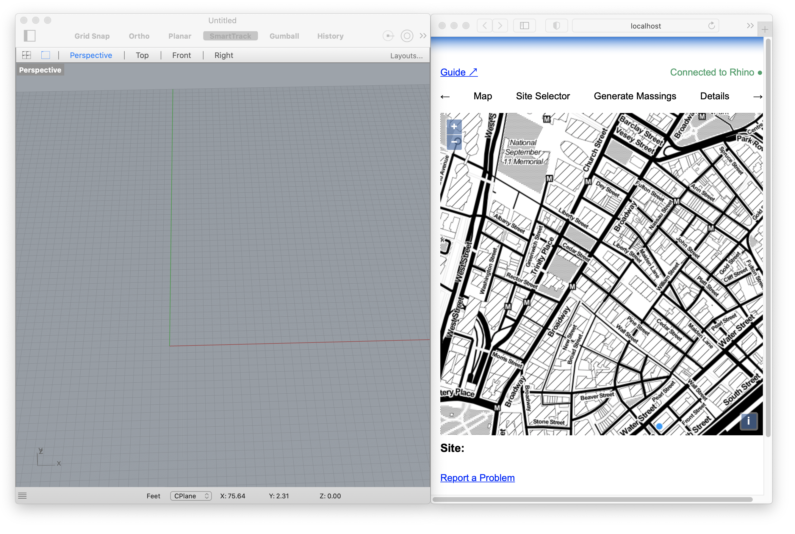

## Process Overview

The diagram below outlines the three major groups of functionality provided by UDTools and the relationships between them.

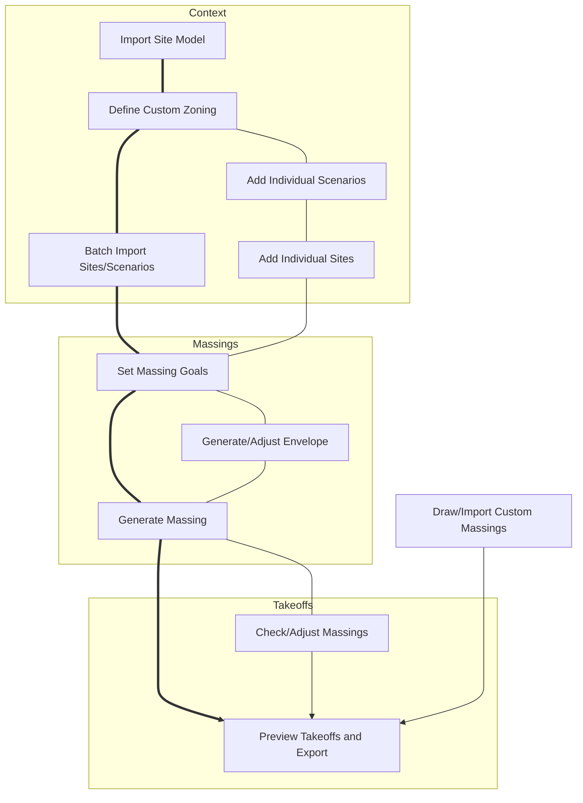

**Context** is provided by importing a site model, defining any custom zoning overrides, and laying out the specific locations (Sites) and moments in time (Scenarios) you want to use in your model.

Next, UDTools can use the context you provide to generate **Massings** for different development scenarios in the model.

Once you have a complete site model populated by massings, **Takeoffs** reflecting floor area totals, parking requirements, unit counts and other metrics can be calculated and exported for use in other software.

## Big Ideas

Before we get into specifics on how to accomplish each of these steps, there are a few key concepts to understand:

- **Tools vs Methods** – 
- **Smart Objects** – Rhino, like most CAD software, focuses on the representation of geometric objects and their positions in space. Both [GIS](https://en.wikipedia.org/wiki/Geographic_information_system) and [BIM](https://en.wikipedia.org/wiki/Building_information_modeling) expand on this by allowing geometric objects to carry *attributes* capable of describing non-geometric properties. UDTools gives Rhino the ability to behave more like a GIS or BIM software capable of representing and manipulating "Smart Objects" like Zoning Lots, Districts and Envelopes with geometric shapes, attributes and rule-based behaviors.
- **Layer Standards** – The main way UDTools interprets your model is by checking where things sit in the layer tree. To avoid problems when drawing new objects, users should be diligent about to placing them on the correct layers.
- **Overrides** – UDTools tries to be as simple as possible for first-time users; when it's used this way, it makes a lot of assumptions. For more advanced users, it's possible to override the built-in rules to deal with more complicated or nuanced situations. Opportunities to define overrides will be highlighted throughout the UDTools tutorials.

## Context

Most of the tasks you can accomplish with UDTools rely on a site model, provided by the [NYC Digital Twin](../digital-twin/about). Each time you start a new project, UDTools can help you fetch a model from the Digital Twin and customize it to meet your needs. You'll only need to do this once for each project; when the Rhino file is saved, all site model information will be included and will be available the next time you open it.

To fetch a site model, first pan/zoom to your area of interest using the map in the Dashboard, then draw a line around the area you want to import.

Next, in Rhino, run the command `UD_ImportModel`. You'll see options to import the "map only", which will ignore the 3D ground surface and buildings, or to "flatten" which will place the 3D buildings on the ground plane. When making this choice, consider that 3D takes longer to fetch than 2D, and a large area will take longer to import than something small.

Click OK. When the command completes you should see the imported geometry added to your model.

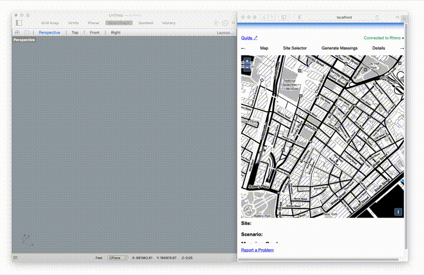

## Setup

The next thing you'll need to do before you can start building and analyzing specific sites is tell UDTools where they are in space, what moments in time you're interested in, and what assumptions to make about zoning at each of those moments.

### Defining Multiple Sites With A Table

UDTools locates sites by associating them with an existing MapPLUTO tax lot by BBL. To handle time, it uses the concept of a *Scenario*, basically a specific moment in the past, present or future and the rules or assumptions that apply. Scenarios are defined by a label (e.g. Existing, No Action) and a zoning district.

This information is provided using a .CSV table, describing each site with:

- a unique **id** for the site
- a comma-separated list of tax **lots** by BBL
- a **zoning** district label for each scenario

Optionally, you can also specify a **group** and a **note**. A template `sites.csv` file is provided with each plugin release and can be edited with Excel, GIS software, or any plain-text editor.

Add sites to your model with the `UD_ImportSites` command, which will ask for the location of the table. UDTools will show a blue boundary around the site's zoning lot if successful.

### Defining Zoning Overrides With A Table

Optionally, you can also provide overrides to the built-in zoning rules with another table. You'll also find a template `zoning.csv` file in the release folder. When using the built-in rules, you'll need to make sure that the zoning defined for each scenario in your sites table matches one of the currently-supported districts. If you're using overrides, make sure your scenario zoning matches the ID of one of the districts defined in the zoning table.

### Defining Sites Manually

When you define sites using a table (see above), scenarios are automatically created for you based on the names of the scenario columns. Before defining sites manually, you need to tell UDTools what scenarios you plan to use by running `UD_AddScenario`.

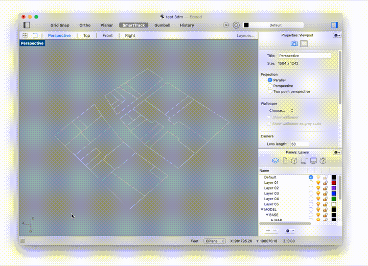

There are two methods available for adding sites by hand, both of which can be accessed through the `UD_AddSite` command. For both, you'll be prompted for a site ID, which can be any sequence of letters or numbers. Then, for each defined scenario, you'll need to enter a built-in zoning district or the ID of one of the entries in your zoning override table. Finally you'll be asked to pick one of the two available methods for defining the site's Zoning Lot.

The first method uses a collection of tax lots, just like when adding sites from a table. Here, you can click on the tax lot outlines in your site model to define the collection of lots you want to use. 

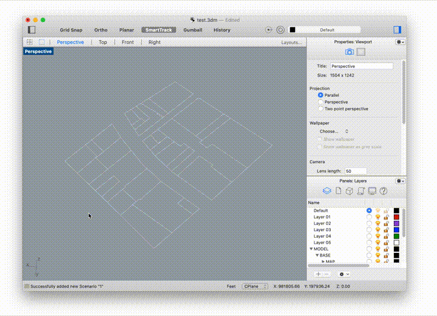

The second method allows you to use a custom zoning lot boundary drawn directly in Rhino. It needs to be a closed, planar curve but not necessarily a polyline – it can include arcs or curved segments if needed. After selecting the zoning lot outline, you'll be asked to identify which of its segments are to be treated as Front, Side and Rear lot lines. Use Ctrl+Shift+Click to select individual segments from the boundary.

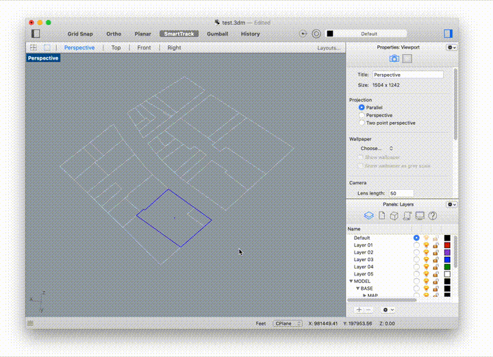

## Build

Now that you're ready to start building on your sites, you have two options. First, UDTools can generate the models "semiautomatically". Here, the process is designed to combine the convenience of a fully-automatic process with the flexibility to make manual adjustments when needed. You can also model completely by hand and use the measurement functions described in the next section as a modeling aid.

Either way, you'll first need to select a specific site and the scenario you want to work on using the Site/Scenario toggles in the Dashboard.

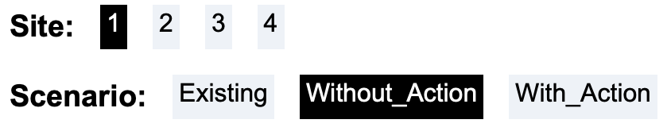

A zoning envelope for the selected site can be generated by running `UD_GenerateEnvelope`.

To produce a full building massing, you'll first need to define "Massing Goals" for the site. Input a comma-separated list of floor heights and use groups in the Massing Goals Dashboard panel. The last item in each list will automatically repeat until all available FAR is exhausted. If no FAR is available for a specified use, nothing will be generated.

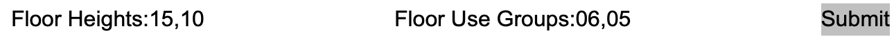  

The Use Group chart from the Zoning Handbook is reproduced here for convenience:

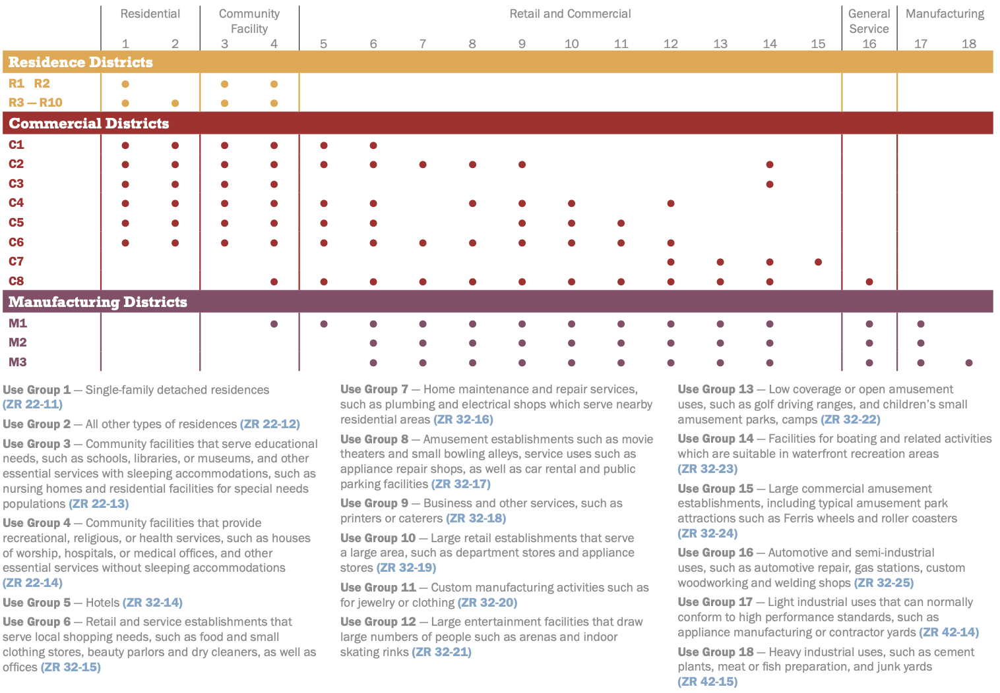 

Then you can run `UD_GenerateMassing` which will add a building massing and envelope to the selected site under the appropriate Scenario layer.

When modeling by hand, you're free to do whatever you want as long as you follow two basic rules. First, only closed polysurfaces with planar faces will be counted for floor area. Second, scenario and use are defined by layer, so be very careful that your model geometry is assigned to the correct layer.

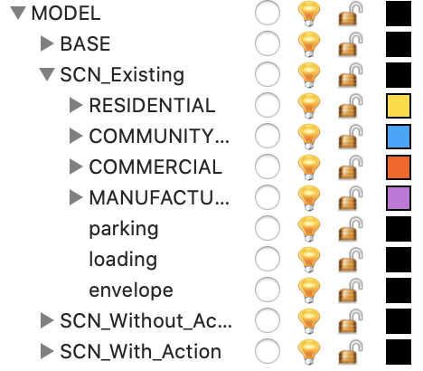 

If a given scenario doesn't have the full layer hierarchy shown above, you can generate it by running `UD_CheckLayers`.

<!-- If you need to create new layers to denote additional uses, the following naming convention and hierarchy must be observed:

- `MODEL` contains all geometry representing a 'real' physical or legal thing.
  - `BASE` is generated automatically when you run `UD_ImportModel`
  - Scenario layers, `SCN_Scenario_Name` contain all geometry particular to a given scenario. Examples: `SCN_Existing`, `SCN_No-Action`, `SCN_Proposal-2`. `SCN_Existing` and `SCN_No-Action`/`SCN_Without-Action` are special cases that pull floor area data from MapPLUTO instead of the model based on the requirements of the RWCDS analysis.
    - `envelope` contains volumes representing the maximum allowable bulk under the Scenario's zoning.
    - `RESIDENTIAL`, `COMMERCIAL`, `COMMUNITYFACILITY` and `MANUFACTURING` group together sublayers with each specific use
      - Specific uses are coded as `NN_use-label` where NN is a zero-padded number corresponding with a use code in the ZR and use-label is an arbitrary tag that can be used to track groups of floor area for non-zoning purposes. Examples: `02_condo`, `16_auto-related`, `06_office`, `06_local-retail` -->

## Measure

Every time the selection changes in Rhino, UDTools will recalculate the development metrics for the selected scenario, and preview them in the Dashboard panel shown below:

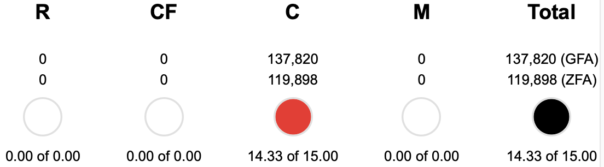  

Here we can see that the selected site is utilizing 14.33 of 15 Commercial FAR available, or a Gross Floor Area of 137,820 sqft. The data shown in the dashboard is just a small subset of what's available from UDTools. You can use the `plugin-data-basic.gh` Grasshopper file provided in the release examples to explore more of what's available, or follow the steps to export a scenario table below.

## Export

If you want to use the data contained in the model with another program (like Excel) or share it with another member of the project team, it can be exported to a file with `UD_ExportScenario`. Rhino will prompt you for a file path, navigate to the desired location and name the file `your-file.csv` (you must provide the extension yourself). All sites under the currently-selected scenario will be exported.
