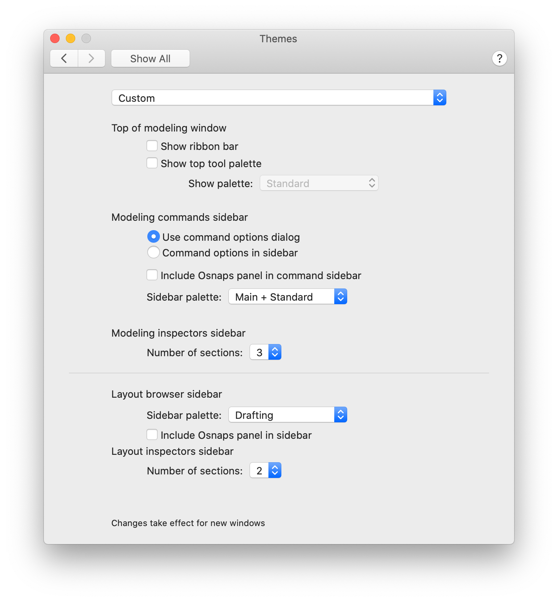

[Rhino](https://www.rhino3d.com/) is the preferred 3D modeling program at NYC Planning. There are hundreds of tutorials available online from various sources, but a few general tips are included here.

## Running Commands

In Rhino, you can run commands by clicking toolbar buttons with your mouse, or by typing their name into the **Command Prompt**. Using the Command Prompt is strongly recommended as it gives you access to the full range of commands without cluttering the interface and can help you model more quickly. For even more speed, you can use **Aliases**: these are custom abbreviated references to full command names and option settings. For example, you could set `r3` to run the `Rotate3D` command. When possible, use keys from one half of the keyboard only; this way you can keep one hand on your mouse at all times. Time spent creating and learning a good set of aliases will pay for itself very, very quickly.

## File management

Rhino will perform best when your file is saved directly on the hard drive of your machine. While it is possible to work from a network drive, large models and frequent file saves will create unnecessary network traffic and slow down your modeling workflow. When working on a team, make sure that you have a clear system for managing changes to the model to avoid conflicts.

## Drawing to scale

As you draw with `Line`, `Polyline` and other tools, Rhino will report the current position of the cursor in XYZ coordinates as well as the length the current curve segment. This can be useful if you're drawing to approximate sizes. If you need dimensions to be exact, you can type them in the command prompt while commands are running. Rhino is capable of performing basic arithmetic and unit conversions on the fly, so things like `5280/4` and `150cm` (even if your model is in feet) are valid entries.

## Measuring your model

`Distance` prompts you to pick two points in the model and returns the linear distance between them. `Length` returns the total length of a curve. `Area` returns the total area of selected closed polylines, hatches or surfaces. `Volume` behaves in a similar way for closed meshes and polysurfaces.

## I have a huge site model and need to select just a small area (three or four blocks)

`SelBoundary` lets you choose an existing closed polyline curve to use create a selection. `Lasso` will prompt you to draw a polyline-like selection area, giving a similar result.

## I need to trim a whole bunch of lines, is there a faster way?

`CurveBoolean` can be used to create new curves from a selection containing many overlapping ones. If you use the `DeleteInput` option, only the new curve will remain from the original selection when the command finishes.

## Interface Customization

On Mac Rhino, you can apply the settings shown below to make the interface look and feel more like Windows. The panel shown in the screenshot is found under Rhinoceros > Preferences > Themes.

