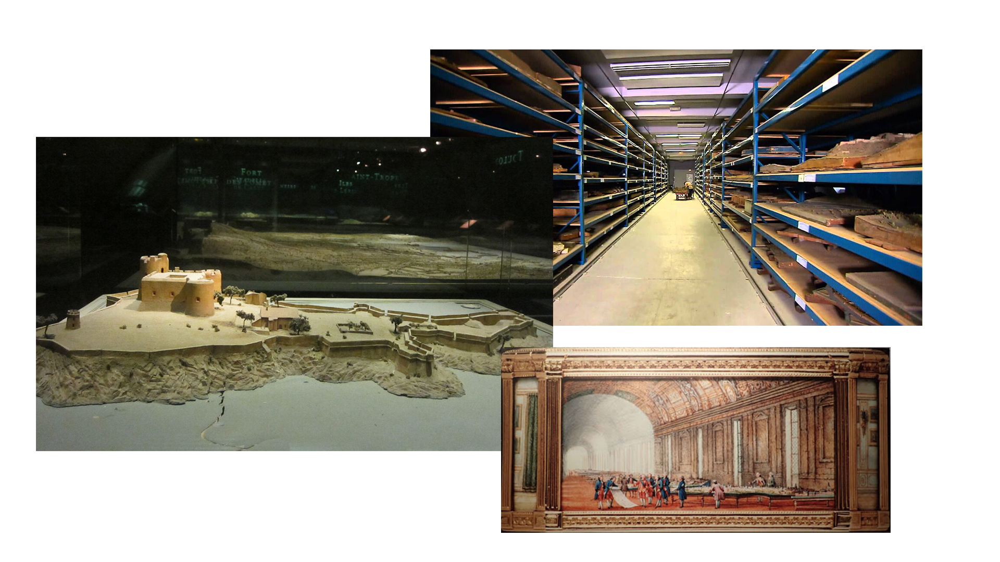
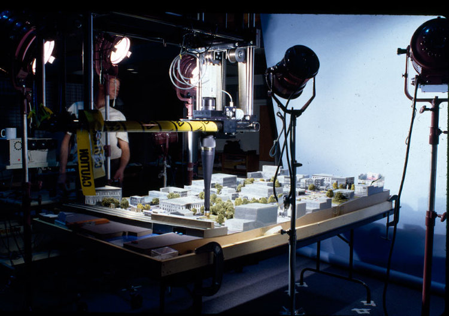
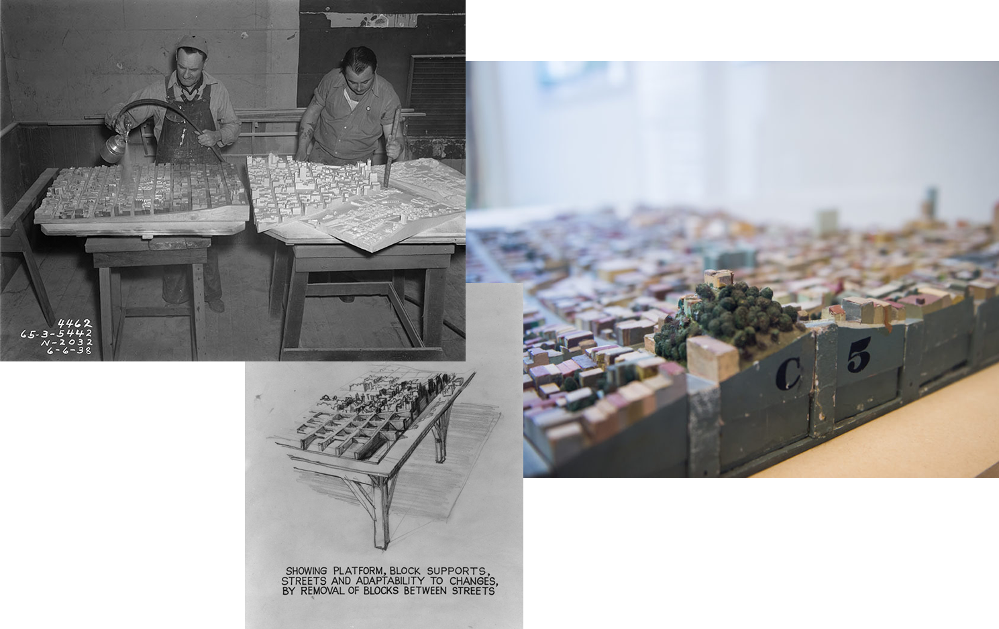
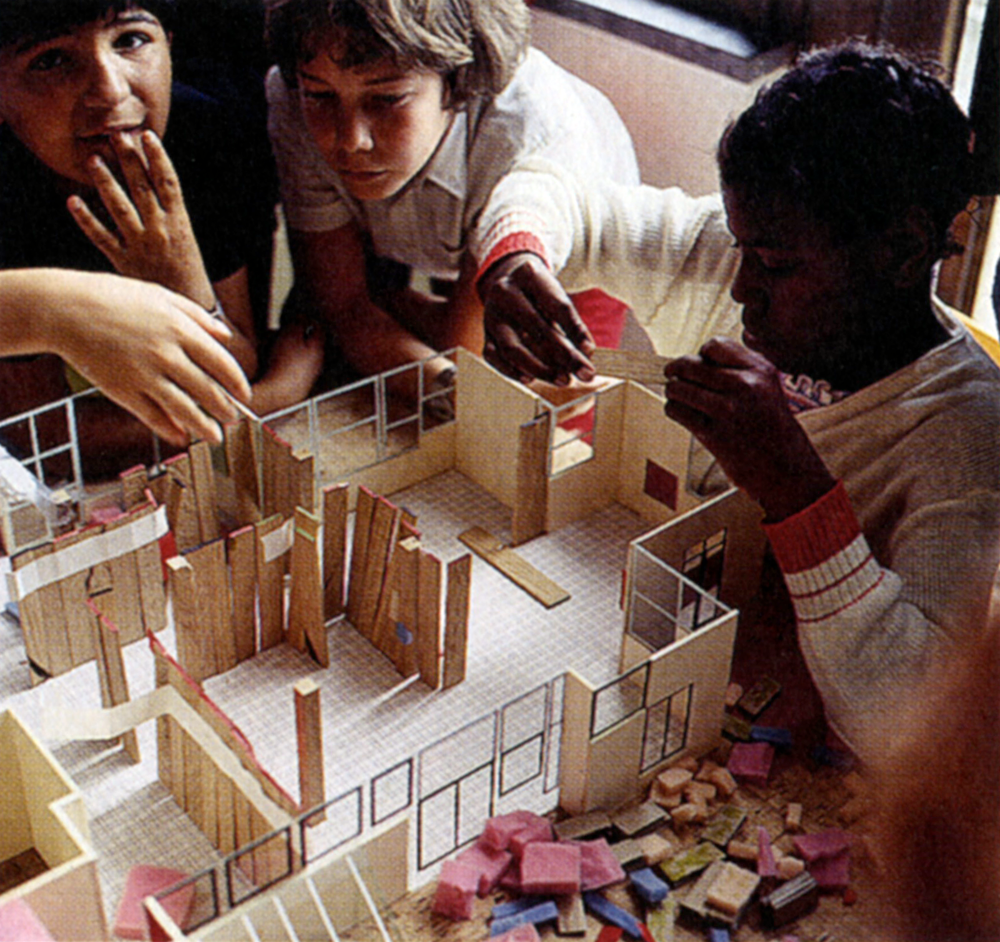
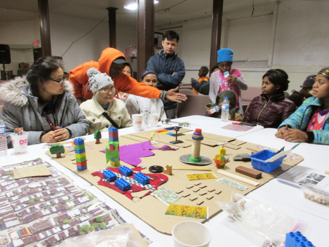

This is the first tutorial in the UDTools training series. It briefly introduces the Urban Design Digital Practice initiative and how we're working to support fast, easy and contextual 3D modeling for urban design and physical planning through UDTools for Rhino the NYC Digital Twin.

The UDTools tutorial sequence assumes basic familiarity with Rhino. Some familiarity with GIS tools + methods is helpful but not required.

## Learning Objectives

* Discuss physical city models of the past and why they still matter
* Introduce the UD Digital Practice Initiative, its goals and core products:
  * the NYC Digital Twin
  * UDTools for Rhino
* Show where to find information and extra help

## Precedents: Physical City Models of the Past

Physical models have been part of urban governance for a long time, and continue to play an important role in planning and urban design practice today. As urban designers, we're interested in models for a few different reasons, as illustrated by the following examples.

First, they're a great way to record and store information about places. Before modern topographic mapping techniques became common, governments commissioned large collections of models to accomplish this goal. One example is the collection of French Plans-Reliefs commissioned by Louis XIV that can now be seen at the [Musée des Plans-Reliefs](https://en.wikipedia.org/wiki/Mus%C3%A9e_des_Plans-Reliefs). These were created from surveys, sketches and notes collected in the field and served as a detailed, readily available record of French towns and their surrounding landscapes for military planners.

Second, models can help answer difficult questions. Here in New York, the [Environmental Simulation Center](http://www.simcenter.org/) started out using physical models to research the impacts of policy changes on how the city looks and feels.

Third, they're flexible and can support unintended uses, often years after they're created. The [San Francisco City Model](https://99percentinvisible.org/episode/model-city/), completed in 1940, started as a WPA project intended to help unemployed woodworkers during the Great Depression. Owing partly to its modular block-by-block design, it proved useful throughout the 20th century in illustrating and testing the effects of urban renewal and was frequently used by local planners for shadow studies.

Fourth, models are tangible and intuitive to work with for people of all ages and backgrounds. This makes them a powerful tool for public engagement and participatory design and planning. The image below shows a housing design workshop in the 1960s under the supervision of Belgian architect Lucien Kroll.

Finally, models can help build consensus and keep people on the same page. This makes them useful for coordinating both professional work (as seen in many architecture offices) and public discussions, like those conducted by the [Center for Urban Pedagogy](http://welcometocup.org/).

### Urban Design Digital Practice

Today we can use digital tools to do a lot of the same things and more. Digital models let us represent complex spatial relationships in a clean, concise way. They expand on physical models ability to coordinate consensus, allowing us to do this remotely without everyone being "at the table". Information contained in the model can be provided in different forms appropriate to the needs of individual users, on an as-needed basis. And as an added bonus, they're cheap to set up and maintain.

Unfortunately, they also have a downside: they're much less intuitive to work with. Working effectively with digital models requires specialized tools, used in conjunction with appropriate methods, to access and manipulate abstract data instead of tangible material.

The Urban Design Digital Practice Initiative at NYC Planning aims to make dealing with digital urban models as easy as possible, through the development and dissemination of **data**, **tools** and **methods**. In doing so, we seek to increase the overall quality of urban design and physical planning in NYC, by making it easier to model, visualize and discuss different visions for the city's public spaces.

### Data: NYC Digital Twin    

The [NYC Digital Twin](/digital-twin/about) aggregates various publicly-available spatial datasets into a single 3D-enabled database. Conceptually, it's like a giant digital model of the entire city, with the ability to automatically make copies of specific areas and hand them off to users. It is set up as a web service so it can provide model data to anyone with an internet connection.

For now, it can only be used with UDTools for Rhino, but we're working on a browser-based viewer to provide access to non-specialist users.

### Tools: UDTools for Rhino

In order to see and interact with models from the NYC Digital Twin, we need special tools. As a first step, we've chosen to develop an add-on (or plugin) for [Rhino](https://www.rhino3d.com/), a 3D CAD software popular with design professionals, that allows users to fetch models of real-world sites across NYC, then quickly model and analyze potential development sites within that context. We call this [UDTools for Rhino](http://localhost:8001/rhino/about). 

UDTools is "aware" of basic zoning concepts and constraints and takes these into account when modeling new sites. Model elements created with UDTools are also aware of their own attributes, and can report back in real time on the floor area, unit counts and parking they represent as adjustments are made.

### Methods: Tutorials and Knowledge-Sharing

This project is intended to build on and amplify existing skills and expertise, not replace them. To that end, we're building out a collection of tutorials and other knowledge resources here on this website to help users learn and stay up-to-date on the resources we're developing.

NYC Planning staff can also access video recordings of training sessions organized as part of the Continuing Education series on [Sharepoint](https://nyco365.sharepoint.com/sites/NYCPLANNING/pdt). Note that specific details in these tutorials are subject to change so it's important to at least cross-reference them with the up-to-date tutorials here.

If you still have questions after completing the tutorials and need additional help, contact the UD Digital Practice team.
