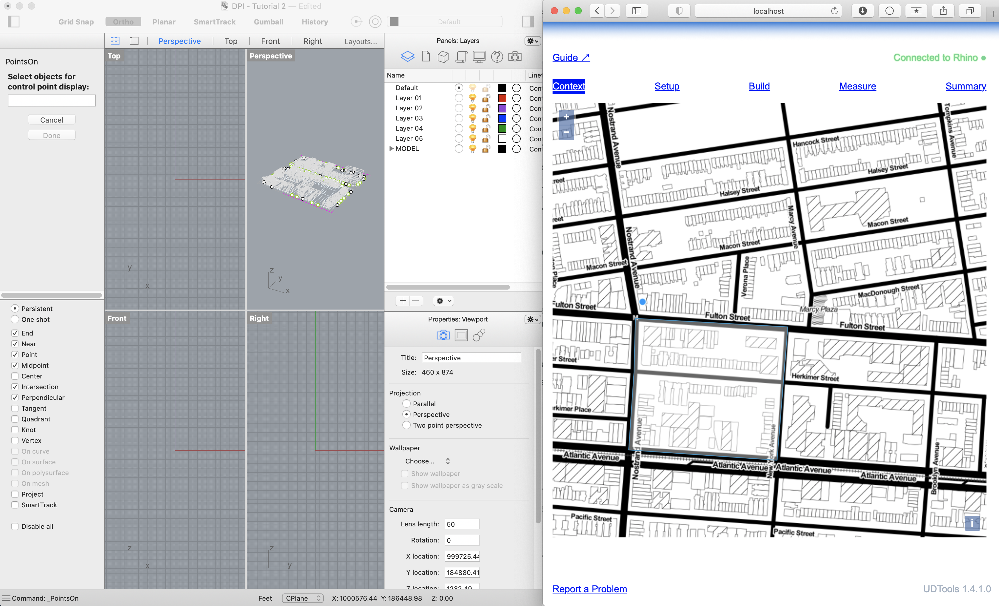
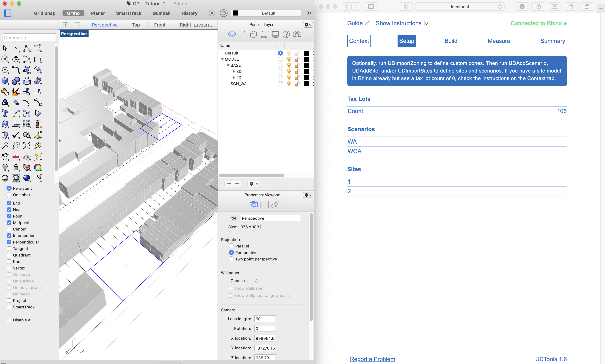
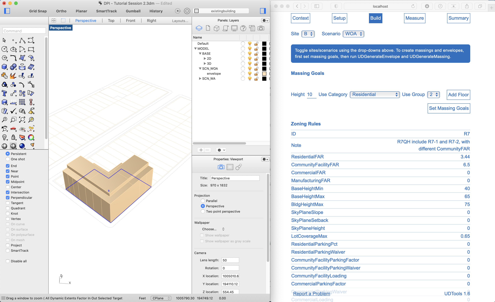
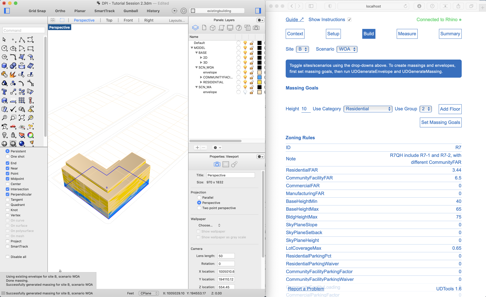
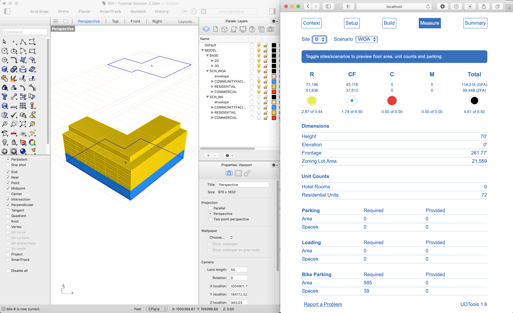
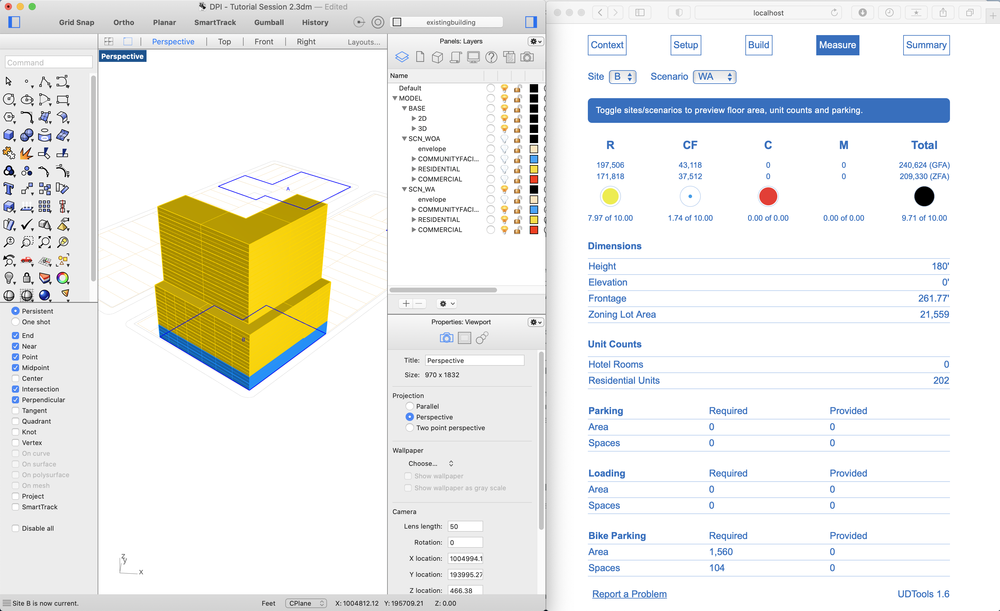
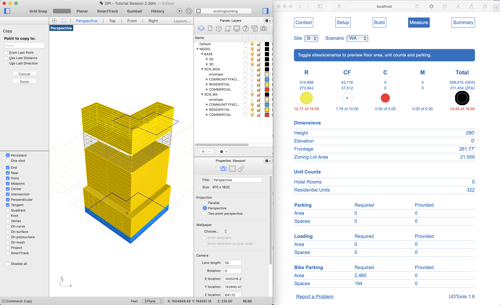
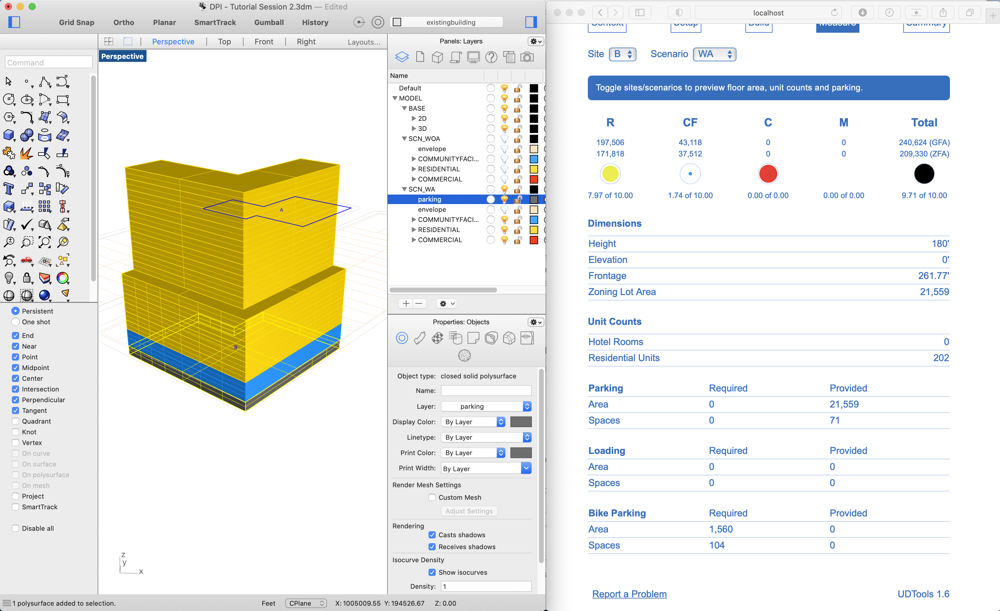

This is the second tutorial in the UDTools for Rhino training series. It introduces the command-line interface used within Rhino and the browser-based UDTools Dashboard that you'll use to preview data, before showing how to model and analyze a single building.

The tutorial assumes basic familiarity with Rhino, and that you've completed the [introduction](/tutorials/rhino/module-1). Some familiarity with GIS tools + methods is helpful but not required.

## Learning Objectives

* Introduce digital modeling concepts relevant to UDTools
* Tour the UDTools Dashboard
* Import a context model from the NYC Digital Twin
* Define a scenario and site for a proposed building
* Generate a zoning envelope and massing
* Preview key metrics in the Dashboard and see how they change in realtime as the massing is modified in Rhino

## Key Concepts

In the last tutorial we introduced Urban Design Digital Practice broadly, our goals, and how a three-part approach involving tools, methods and data will help get us there together. Finally, we introduced the specific tools and resources currently offered to address each, UDTools for Rhino, this tutorial sequence, and the NYC Digital Twin.

The bulk of this tutorial and the next will provide specifics on how to use UDTools for Rhino to first model and evaluate a single building, then define, generate and summarize data for a large collection of sites all at once.

Before we get started on specifics, though, it's helpful to have some general concepts in mind in order to better understand how UDTools works and what it can do. First is how UDTools is related to other ways of thinking about and interacting with digital models of urban space. People typically do this in one of three ways, summarized below.

CAD, or computer-aided design, is concerned with the two-dimensional and three-dimensional shapes of things for construction and manufacturing purposes. It usually provides ways of graphically annotating different model elements and organizing them in groups and layers. CAD software most often deals with objects the size of a building or smaller.

GIS, which stands for geographic information systems, deals with shapes that are permanently linked to database records describing their properties or *attributes*. These shape-attribute records usually come in the form of published spatial data sources that can be brought together within a GIS environment. Most of the time, but not always, GIS is used as a way to produce maps and perform map-based analysis tasks, usually at a range of scales between a neighborhood and the world.

Building information management, or BIM, describes buildings as a hierarchical collection of specific elements like walls, ceilings, windows and doors. Each has a shape, attributes and element-specific *behaviors* that can be used to guide modeling, compute quantity takeoffs or generate renderings. As its name indicates, BIM is concerned only with buildings and building-scale infrastructure, although related concepts like [digital twins](https://en.wikipedia.org/wiki/Digital_twin) are more generalizable.

Rhino by itself follows the logic of conventional CAD, but it is designed to be extensible. In other words, it provides easy ways for software developers to add new functionality that builds on Rhino's sophisticated 3d underpinnings. Hundreds of domain-specific Rhino plugins exist for jewlery design, manufacturing, shipbuilding and beyond.

UDTools aims to do something similar for physical planning and urban design, first by enabling Rhino to import outside spatial data sources to build up site models that include the attributes of the original source, and secondly by adding new model element types that represent zoning and urban design concepts with BIM-like specificity. We call these "smart objects" to distinguish them from plain Rhino geometries. 

UDTools interprets plain geometry as smart objects based on layers, object names and user input. The success of this relies on a UDTools-specific **layer standard** which, like the AIA national CAD guidelines, makes sure models are organized in a consistent way to ensure readability by other users. But here it's also essential to the software's ability to read and interpret the geometry in the model as the right kind of smart object for calculations. The layer a given geometry is placed on is used in UDTools to express what *type* or category of smart object it should be interpreted as.

Rhino object names are used to mark individually significant objects and link them with database records. For example, the polygons on the `taxlot` layer are named with the lot's [BBL](https://en.wikipedia.org/wiki/Borough,_Block_and_Lot) identifier, which is used to associate the polygon with the correct attributes from MapPLUTO, thereby creating a TaxLot smart object.

As UDTools interprets your model, it makes lots of assumptions along the way. Simplifying the modeling and analysis process requires the use of dozens of default assumptions that obscure a lot of nuance in the interest of making things fast and easy. But in cases where you need to dig deeper, UDTools provides a mechanism for overriding these defaults. This feature will be gradually introduced through future tutorials.
  
You may be thinking, so what? How does this benefit me? There are a lot of potential answers – once you have smart objects with attributes and behaviors,  you can begin to ask them simple questions directly, or string them together to answer more complex ones. UDTools is designed in part to be flexible, and to be compatible with a broader ecosystem of tools that can help us design and plan with greater awareness of context and the potential impact of our choices.

The flipside of this flexibility is that the question and the setup you choose to answer it really matter. We should say outright that UDTools is not a "magic machine" that spits out answers automatically but rather something that depends on you, the user, and the knowledge and expertise you bring to the modeling and analysis process.

With that, let's get started!

## Installation

Installation instructions for UDTools can be found on the Digital Practice [docs site](/rhino/install). You'll need Rhino 6 or 7 installed on your computer before following these easy steps:

- Download the latest release from [Sharepoint](https://nyco365.sharepoint.com/:f:/s/NYCPLANNING/ud/EpToV_nrVkZLhbH_9nu93xEBxMtwONp9tAb5MKmltODayQ?e=ZeuDHf)
- Unzip the folder and double-click the appropriate file for your OS
- Restart Rhino

## Interface

The easiest way to use Rhino is through various command button panels, which are included in the window layout by default. Typing in commands to the command prompt, though, is faster once you learn the command names. You can save even more time by defining and memorizing command aliases, which associate full names with a single key or sequence of keys.

Run the command `UDTools` to start, then `UDDashboard` to launch the Dashboard.

This is the UDTools Dashboard, it's the easiest way to interact with UDTools for most tasks. It's built as a webpage and runs in your browser, but it only talks to Rhino and you can pretend like it's part of Rhino for now.

The dashboard is like a "remote control" for rhino, it triggers commands and makes changes to your model, reads it and displays information in a more accessible way. Counterclockwise from the upper right, here's what you see:

- Connection Indicator, shows we're hooked up to Rhino, this will turn off if there's a problem. You can click this to reconnect if, for example, you have to restart Rhino.
- Instructions toggle, turns the short instructions for each panel on or off
- Guide link, will open the Digital Practice docs site to access tutorials and more
- Report problem link (show how this works)
- Version indicator, in case you don't have it when communicating about problems

Next we have five panels that deal with different parts of the modeling and analysis process. Content in the main window changes when you switch tabs. We'll walk through them one-by one as we model a single site.

## Import a Site Model

First we have to use the map under `CONTEXT` to define a study area. Click points on the map to make a polygon, kind of like you're using scissors to cut out a chunk of the city. In Rhino you'll see a message that UDTools received the boundary from the Dashboard. Next run the command `UDImportModel`. You'll have three options:

- Map Only: 2d map things only (no 3d buildings or ground)
- No Topography: 3d buildings but sitting on ground plane
- All: all 3d geometry plus ground surface

This may take some time but you'll see a bunch of geometry show up in your model after it finishes. After clicking import model, may have to move rhino display to redraw.

* introduce concept of the layer tree
* udtools uses a fixed *layer standard* to organize information
* MODEL > BASE > 2D/3D, look at layers that are in here

You can also check to see object names on the layers that use them. Polygons on `taxlot` have their BBL ids, and the polysurfaces on `existingbuilding` will be identified by BIN.

⚠️ Reminder: The map is not the territory! When working with site models from the NYC Digital Twin, it's important to remember that the accuruacy of the model is only as good as the [datasets it contains](https://ud-digital-practice.netlify.app/digital-twin/about). Remember to consult the metadata of each layer to understand how it was made and any limitations before trusting what appears on your screen.

## Define Scenarios and Sites

* next step is to define *sites* and *scenarios* for analysis
* Let's switch over to the `Setup` tab

* site - a fixed geographic location (stays the same over time)
* scenario - a moment in time (conditions, like zoning, change with time)
* what's shown in the dashboard is the intersection between a site and scenario - a *snapshot*
* check back in on layers

* scenarios are stored as separate layer trees
* sites are stored as different geographic locations
* different ways to set up your file: this session, basic one-by-one commands

* first, add scenarios (`UDAddScenario`) - takes label only, this can be anything you want ***(no dashes or spaces(If you accidentally enter a space or dash it will register it)(locked) (example: S1)***
* then, add sites (`UDAddSites`) ***(ex. of site label: A,B,... or 1,2,3,...)*** 

* has to be done in Rhino, dashboard doesn't provide ability yet
* sites require ID first
* then, zoning to use for each label
* pick lots from lots layer to use as zoning lot (one or more)

* UDRemoveSites allows you to remove if you accidently created the wrong boundary
* alternate version, custom lot **(Cut if time consuming)**

* same as above, except:

* create new geom on 2D > lot-custom layer (or wherever convenient)
* talk about how this can be either a subdivided site or an arbitrary place
* select polyline
* select front lot lines, side lot lines and rear (explain why, software is able to understand which lot line types to use when you have the context, but can't figure it out when it's an arbitrary geometry)
* as you add sites and scenarios you can see the list gradually populate to reflect what's in your model. Each new site should also have a blue line around it in the Rhino window with the ID in the middle.

In the next tutorial, we'll cover how to define and import sites in bulk to avoid the tedium of doing this dozens of times for a large project. We'll also look at how to set overrides to the built-in zoning definitions.

## Generate Envelopes and Massings

Next let's switch over to the "Build" panel. Up at the top you should see dropdowns for each site and scenario. The zoning lot you're currently working with is defined by the intersection of those two setttings. If you had multiple sites or scenarios, you could use these drop-downs to switch.

* When you change, you should see different parts of the rhino model shown, updates to the zoning rules, and Rhino will report back that Scenario/Site N is now current. In the Rhino layer panel, also notice that toggling through your scenarios has created new layers for each one, prefixed `SCN_` to distinguish them from the `BASE`.
* To generate massings for defined sites in the model, UDTools needs two things, zoning rules and massing goals
* We used built-in zoning definitions earlier when we defined the sites, so the rules will be built-in in this case. You can see them on-screen under Zoning Rules in the Dashboard.
* Massing goals define what kind of building you're trying to make. They're provided as a list of floor-to-floor heights and zoning use groups corresponding to different floors of your building.

* To define the massing goals, you'll build up a list starting at the ground floor and working your way up. The definition for the last floor in the list will be repeated until FAR runs out.
* Define a single floor by filling out the form shown in the row next to "Add Floor". Height is the floor-to-floor height in feet, Use Category is the broad category and Use Group is a specific use group from the Zoning Resolution. "Add Floor" will add the defined floor to the list and you'll see it appear above.
* Repeat until you have everything defined.
* Once the massing goals are ready for the whole building, click "Set Massing Goals" and you should see a message in Rhino that they were received. 

Now you're ready to generate a massing. You can either run the entire process at once or step through it gradually and make adjustments as needed. We'll go through step-by-step first then run it all at once so you can see the difference.

In Rhino, run `UDGenerateEnvelope` and a zoning envelope should appear. Notice that it's been placed on an `envelope` sublayer within your current scenario. Select the envelope and Rhino and notice that it's modeled as a *closed solid polysurface*. This is how Rhino understands what we'd call a volume or a solid in plain english.

Since zoning is so complicated, it's possible you won't get a perfect result. So UDTools gives you the ability to modify the zoning envelope when needed, before generating a building massing. Think of this as a special kind of override versus the defaults. Here, you have an opportunity to bring your professional knowledge to bear directly on the geometry itself, not just the rules or assumptions that go into it.

Try making a small change to the envelope before moving on to the next step. Some methods to try:

- Cmd-Shift-Click to select and push/pull individual faces or edges.
- Draw lines or polylines on the ground plane and use `Slab` or `ExtrudeCrv` (with the `solid` option turned on) to create new closed solid polysurfaces, then `BooleanDifference` with the envelope
- Extrude a curve vertically to get a cutting surface, then BooleanSplit with the envelope to cut it into parts.

When you're done, just make sure the result is still a closed solid polysurface, and that it's on the envelope sublayer of your current scenario. 

Run `UDGenerateMassing`, using the 'Single' mode, and UDTools will attempt to fill your envelope with floors using all available FAR. You may need to pan the Rhino window before the result appears. Notice that new sublayers for the broad and specific uses of each floor have been created and that each floor is assigned to a specific use group sublayer.

Try `UDGenerateMassing` one more time, this time on a different site without an existing envelope. This time it'll generate an envelope and a massing all in the same step automatically. To start over, simply delete floors and/or envelopes from the model and run the commands again.

## Measure

Finally, let's switch to the Measure panel. Here you'll find information about the various development metrics, including floor area and unit counts, calculated by UDTools for a given site and will be able to see them update in real time as the model changes.

The table at the top shows GFA and ZFA totals for each major use category and the massing overall, and also shows graphically how much of the available FAR is utilized for a particular use. A full bubble means all of the available FAR is in use, while an empty one means none. Bubbles won't appear for uses that aren't allowed under the scenario zoning.

Lock and turn off the envelope sublayer for the current scenario. Select a few of the floors you modeled in the previous section and delete them. You'll see the numbers and graphic indicators change in the Dashboard. If you need to fine-tune the massing to get right up to the edge of allowable FAR for example, you can use this feature as a guide as you work in Rhino.

Try copying one of the remaining floors upwards a few times, using object snaps to make sure it stays flush with the rest of the massing. At a certain point, you may see indicators turn red in the Dashboard. This means you've modeled something that breaks a rule! UDTools won't stop you from doing this, but it can tell you when there's a problem. Take away a few of the floors and you'll see the FAR indicator turn black again.

The Measure panel can also help you model things that aren't yet generated automatically like parking. If you copy your ground floor below grade, and place it on a new scenario sublayer called `parking`, you'll see the area reflected under Provided Area, and an estimate number of spaces will also appear.

A few other things on the page to take note of:

- Dimensions. Note that street frontage is for the zoning lot, not necessarily the facade of the massing.
- Unit counts. These are estimates based on floor-area-per-unit assumptions.
- Parking, Loading and Bike Parking. These show the estimated number of spaces provided (calculated the same way as unit counts), the number required by zoning, and the estimated area required for comparison with what's provided.

Parking won't be modeled automatically at this time, but you can easily add parking to your model by drawing your own geometry and placing it on `parking`, `loading` or `bikeparking` layers under your current scenario.

In the [next tutorial](/tutorials/rhino/module-3) we'll look at some more advanced techniques for modeling, including how to define custom zoning, automate complex site/scenario definitions and generate massings in bulk.