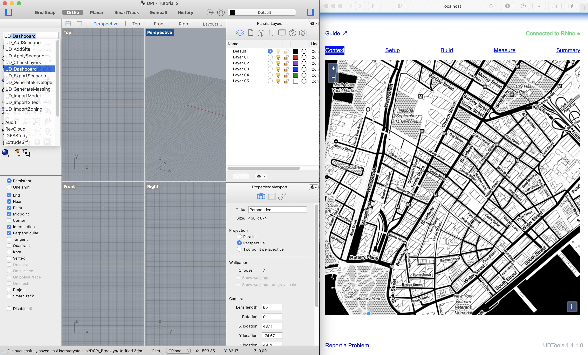

### Audience

* designers who anticipate using UDTools
* but all are welcome

### Prerequisites

* Session 1
* Basic familiarity with Rhino (expand)
* Helpful but not required to have some understanding/experience with GIS

## Learning Objectives

* Provide an overview of key concepts and recommended practices for urban modeling with UDTools + Rhino 
* Tour UDTools’ main interface, the Dashboard, and understand how it relates to other available interfaces for advanced users (Rhino commands, Grasshopper access) 
* Import a site model from the NYC Digital Twin and review the UDTools layer standard 
* Define Scenarios and Sites, learn how UDTools uses these to structure space and time and evaluate key zoning concepts 
* Generate a massing for a defined site; understand how development metrics are calculated and previewed 
* Export data for use in Excel or GIS 

## Key Concepts

* Pick up from last time: towards easy urban modeling

  * CAD experience? (AutoCAD, Rhino, Sketchup, Microstation/Other)
  * How many people have GIS experience?
  * How many people have BIM experience, like Revit?
  * Can anyone that raised their hand offer a definition for what GIS or BIM is? (What makes it different than a drawing in powerpoint?)
  * The goal of UDTools is to make certain kinds of modeling you can do in GIS/BIM way easier
  * How do we represent urban spaces in Rhino?

    * Rhino geometry basics

      * Points, Lines, PolyLines. Analogs in GIS (Polygons are closed polylines, with or without holes)
      * Surfaces, PolySurfaces and Meshes
    * Attributes

      * Rhino has very limited attribute functionality outside of display properties/materials etc. It is mainly a tool for describing shapes of things
      * GIS has attribute table, that can describe any number of custom properties for each object
      * ⚠️ UDTools "interprets" geometry as special "smart objects" with geometry, attributes and behavior, and lets you deal with them inside Rhino
  * How does this work?

    * Layer Standard. like AIA CAD guidelines, used to guarantee models people work on are organized the same way so complex models are readable by other people
    * here we use it "semantically" that is, it gives the geometry in the rhino model special meaning. A point is just a point until you put it on `street-tree`, then it represents the location of a specific street tree captured in the street tree census
    * as UDTools interprets your model, it makes lots of assumptions along the way. Making this easy requires the use of dozens of "default assumptions" that obscure a lot of nuance in the interest of simplification. But UDTools is also designed to allow you to override these assumptions when you need to. in future tutorials we'll look at how this is done at different points in the process
  * OK so what can I do with this?

    * There is a lot but today we're focusing on simple zoning analysis
    * Once you have smart objects, you can interact with them using special tools to ask them questions
    * You can say, OK zoning lot, what does your maximum zoning envelope look like? How much floor area could I reasonably fit in there? etc.
    * You can also say "Who owns you?" or "When was the last time someone pulled permits for a major construction project here"
    * (DPI philosophy)

      * The question really matters
      * tools vs methods: not just a "magic machine" that spits out answers but something that participates in an existing ecosystem of professional tools that you can use in a number of ways to solve different problems
      * Current components:

        * NYC Digital Twin

          * centralized data model containing everything we know from Open Data and other sources about the current state of the city
        * UDTools, extends Rhino to do cool stuff ***(or digitally compute information)*** related to urban design and zoning

          * Connect with the Digital Twin, 
          * “Understand” zoning and urban design concepts, 
          * Generate zoning-compliant massings for real-world or hypothetical sites, 
          * Produce detailed take-offs of key development scenario metrics.
        * UDTools grasshopper components
        * many other things - concept of **tool ecosystem**

## Installation

* how to install. this is already running on my machine, but here's how you would do it:

  * Prerequisites:

    * Rhino 6 or 7 running on Mac/PC, either agency desktop or personal computer
  * From \[UD Digital Practice Docs] page on installation:

    * download
    * unzip
    * choose correct file for your platform
    * double-click, rhino will install
    * note- on windows may need to unblock for windows firewall
    * look at example files

## Interface

* **Tour UDTools’ main interface, the Dashboard, and understand how it relates to other available interfaces for advanced users (Rhino commands, Grasshopper access)**

  * Rhino comes with a bunch of graphic interfaces by default, I have mine slightly customized to save on-screen space. The main way most people use Rhino is through a command prompt because it saves time once you learn the commands. You can save even more time by defining and memorizing command shortcuts.
* Run the command `UDTools` to start, then `UDDashboard` to launch the Dashboard

  

  * this is the UDTools Dashboard, it's the easiest way to interact with UDTools for most tasks. It's built as a webpage and runs in your browser, but it only talks to Rhino and you can pretend like it's part of Rhino for now.
  * the dashboard is like a "remote control" for rhino, it triggers commands and makes changes to your model, reads it and displays information in a more accessible way. here's what you see:

    * connection indicator, shows we're hooked up to Rhino, this will turn off if there's a problem. You can click this to reconnect if, for example, you have to restart Rhino.
    * guide link, goes to the Digital Practice docs site for more details
    * instructions toggle, turns the short instructions on or off
    * report problem link (show how this works)***(get screen shot to attach to email)***
    * version indicator, in case you don't have it when communicating about problems

Next we have five tabs that deal with different parts of the modeling and analysis process. Content in the main window changes when you switch tabs.

* we'll walk through them one-by one as we model a single site
* one last way to interact with Rhino/UDTools is through Grasshopper, a visual programming environment for Rhino. This lets you access and manipulate data in the rhino model directly, and works with a system of components and wires, each component does something with the data and wires move it around from place to place. We'll cover this in more depth in a later tutorial. ***(should i type grasshopper to show the options but not click on any of them?)***

## Import a Site Model

* CONTEXT **Import a site model from the NYC Digital Twin and review the UDTools layer standard** 

  * kick off methods/process section. look at diagram/flow chart
  * first we have to use the map under `CONTEXT` to define a study area. Click points on the map to make a polygon, kind of like you're using scissors to cut out a chunk of the city. In Rhino you'll see a message that UDTools received the boundary from the Dashboard. Next run the command `UDImportModel`.
  * three options:

    * Map Only - 2d map things only (no 3d buildings or ground)
    * No Topo - 3d buildings but sitting on ground plane
    * All - all 3d geometry plus ground surface
  * This might take some time but you'll see a bunch of geometry show up in your model after it finishes. After clicking import model, may have to move rhino display to redraw (bug, missing redraw call?)
  * introduce concept of the layer tree

    * udtools uses a fixed *layer standard* to organize information
    * MODEL > BASE > 2D/3D, look at layers that are in here

      * note BBL ids on tax lots
      * remarks about accuracy, especially for different point layers

        * street trees accurate generally, litter baskets not as good
      * 3D - note BIN numbers on buildings
    * meant to be a starting point for modeling not an accurate representation of the physical city
    * ⚠️the map is not the territory! neither is a 3d model, even if it looks more like the real thing

## Define Scenarios and Sites

 **Define Scenarios and Sites, learn how UDTools uses these to structure space and time and evaluate key zoning concepts**

* next step is to define *sites* and *scenarios* for analysis
* Let's switch over to the `Setup` tab

  * site - a fixed geographic location (stays the same over time)
  * scenario - a moment in time (conditions, like zoning, change with time)
  * what's shown in the dashboard is the intersection between a site and scenario - a *snapshot*
  * check back in on layers

    * scenarios are stored as separate layer trees
    * sites are stored as different geographic locations
  * different ways to set up your file: this session, basic one-by-one commands

    * first, add scenarios (`UDAddScenario`) - takes label only, this can be anything you want
    * then, add sites (`UDAddSites`)

      * has to be done in Rhino, dashboard doesn't provide ability yet
      * sites require ID first
      * then, zoning to use for each label
      * pick lots from lots layer to use as zoning lot (one or more)
    * alternate version, custom lot

      * same as above, except:

        * create new geom on 2D > lot-custom layer (or wherever convenient)
        * talk about how this can be either a subdivided site or an arbitrary place
        * select polyline
        * select front lot lines, side lot lines and rear (explain why, software is able to understand which lot line types to use when you have the context, but can't figure it out when it's an arbitrary geometry)
  * as you add sites and scenarios you can see the list gradually populate to reflect what's in your model. Each new site should also have a blue line around it in the Rhino window with the ID in the middle.
  * in RWCDS session, will talk about how to define and import sites in bulk
  * will also cover custom zoning overrides

## Generate Envelopes and Massings

* BUILD **Generate a massing for a defined site; understand how development metrics are calculated and previewed**
* for this one, let's switch over to the Build tab
* now, instead of just a list, you see dropdowns for each site and scenario. The snapshot you're currently on is defined by the combination/intersection of those two setttings. Change to another site, then another scenario to see how it works.

  * when you change, you should see different parts of the rhino model shown, updates to the zoning rules, and Rhino will report back that Scenario/Site N is now current. In the Rhino layer panel, also notice that toggling through your scenarios has created new layers for each one, prefixed `SCN_` to distinguish them from the `BASE`.
  * To generate massings for defined sites in the model, UDTools needs two things, zoning rules and massing goals
  * we used built-in zoning definitions earlier when we defined the sites, so the rules will be built-in in this case. You can see them on-screen under Zoning Rules in the Dashboard.
  * Massing goals define what kind of building you're trying to make. They're provided as a list of floor-to-floor heights and zoning use groups corresponding to different floors of your building.
* To define the massing goals, you'll build up a list starting at the ground floor and working your way up. The definition for the last floor in the list will be repeated until FAR runs out.
* Define a single floor by filling out the form shown in the row next to "Add Floor". Height is the floor-to-floor height in feet, Use Category is the broad category and Use Group is a specific use group from the Zoning Resolution. "Add Floor" will add the defined floor to the list and you'll see it appear above.
* Repeat until you have everything defined.
* Once the massing goals are ready for the whole building, click "Set Massing Goals" and you should see a message in Rhino that they were received.

Now you're ready to generate a massing. You can either run the entire process at once or step through it gradually and make adjustments as needed. We'll go through step-by-step first then run it all at once so you can see the difference.

In Rhino, run `UDGenerateEnvelope` and a zoning envelope should appear. Notice that it's been placed on an `envelope` sublayer within your current scenario. Select the envelope and Rhino and notice that it's modeled as a *closed solid polysurface*. This is how Rhino understands what we'd call a volume or a solid in plain english.

Since zoning is so complicated, it's very likely you won't get a perfect result. So UDTools gives you the ability to modify the zoning envelope when you need to before generating a massing. Think of this as a "tool sharpening" moment, can overcome the shortcomings of the "blunt tool" of built-in zoning with something that makes more sense
    - designer or planner can intervene with information you know that the tool doesn't know

Try making a small change to the envelope before moving on to the next step. Some methods to try:

* Cmd-Shift-Click to select and push/pull individual faces or edges.
* Draw lines or polylines on the ground plane and use `Slab` or `ExtrudeCrv` (with the `solid` option turned on) to create new closed solid polysurfaces, then `BooleanDifference` with the envelope
* Extrude a curve vertically to get a cutting surface, then BooleanSplit with the envelope to cut it into parts.

When you're done, just make sure the result is still a closed solid polysurface, and that it's on the envelope sublayer of your current scenario.

Run `UDGenerateMassing`, using the 'Single' mode, and UDTools will attempt to fill your envelope with floors using all available FAR. You may need to pan the Rhino window before the result appears. Notice that new sublayers for the broad and specific uses of each floor have been created and that each floor is assigned to a specific use group sublayer.

Try `UDGenerateMassing` one more time, this time on a different site without an existing envelope. This time it'll generate an envelope and a massing all in the same step automatically. To start over, simply delete floors and/or envelopes from the model and run the commands again.

## Measure

Finally, let's switch to the Measure panel. Here you'll find information about the various development metrics, including floor area and unit counts, calculated by UDTools for a given site and will be able to see them update in real time as the model changes.

The table at the top shows GFA and ZFA totals for each major use category and the massing overall, and also shows graphically how much of the available FAR is utilized for a particular use. A full bubble means all of the available FAR is in use, while an empty one means none. Bubbles won't appear for uses that aren't allowed under the scenario zoning.

Lock and turn off the envelope sublayer for the current scenario. Select a few of the floors you modeled in the previous section and delete them. You'll see the numbers and graphic indicators change in the Dashboard. If you need to fine-tune the massing to get right up to the edge of allowable FAR for example, you can use this feature as a guide as you work in Rhino.

Try copying one of the remaining floors upwards a few times, using object snaps to make sure it stays flush with the rest of the massing. At a certain point, you may see indicators turn red in the Dashboard. This means you've modeled something that breaks a rule! UDTools won't stop you from doing this, but it can tell you when there's a problem. Take away a few of the floors and you'll see the FAR indicator turn black again.

The Measure panel can also help you model things that aren't yet generated automatically like parking. If you copy your ground floor below grade, and place it on a new scenario sublayer called `parking`, you'll see the area reflected under Provided Area, and an estimate number of spaces will also appear.

* other things on the page

  * dimensions, unit counts

    * not ethat street frontage is for zoning lot not neccessarily massing
    * unit counts etc are estimates based on sqft assumptions
  * parking/loading/bike parking

    * number of spaces, approx area required
* demo how to solve for bike parking

  * won't be modeled automatically, but you can add on a parking layer to see how it will affect the massing
  * shortcomings will be highlighted in red, once you provide required amount it will go black

The Summary tab shows an overview of IDs, ZFA totals for each major use category and overall, and an estimated residential unit count. Since it shows all sites across the scenario, only the scenario toggle is displayed at the top.

In the [next tutorial](/tutorials/rhino/module-3) we'll look at some more advanced techniques for modeling, including how to define custom zoning, automate complex site/scenario definitions and generate massings in bulk.