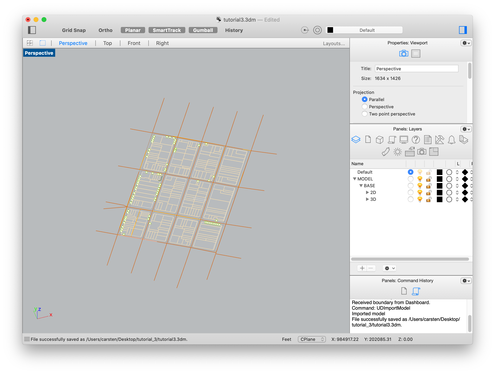

This is the third tutorial in the UDTools for Rhino training series, focused on neighborhood-scale projects and RWCDS documentation. Like the second session, the intended audience is urban designers and other Rhino users who will be tasked with producing models and quantity takeoffs as part of their everyday work. However, project managers and others involved in the RWCDS process may find the included discussions on project roles and best practices for iterative process helpful as well.

## Learning Objectives

* Situate UDTools-based RWCDS analysis in the overall CEQR process; review key stakeholders and roles
* Review key concepts from building-scale tutorial (layers, sites/scenarios)
* Introduce new concepts related to large-scale work (source-of-truth, dimensionality)
* Define custom zoning rules and proposed zoning changes
* Define sites and scenarios in bulk
* Batch-generate massings for multiple sites at once
* Recap major inputs and outputs and outline recommended approaches to iteration when working with a team, and how to update data exports incrementally

## The RWCDS in Context

For generic actions (as contrasted with localized actions) under CEQR, such as a large rezoning, a Reasonable Worst Case Development Scenario needs to be developed and documented. Generally speaking, documentation needs to show the following:

* Describe conditions at three moments in time, usually referred to Existing, No-Action and With-Action (also called scenarios)
* All development sites identified geographically by tax lot BBL
* Development sites marked as Projected and Potential
* Detailed floor area breakdowns by use, with specific flags for supermarkets, medical office uses and several other categories.
* Provide a 3D model, 2D shapefiles, and tabular data in Excel format

Many CEQR-related questions can be addressed by looking at the \[CEQR Technical Manual](https://www1.nyc.gov/site/oec/environmental-quality-review/technical-manual.page)

UDTools is designed to make the documentation of a RWCDS easier to produce and update. Using it effectively, however, requires more than just technical know-how: good project management and coordination are also needed to achieve success.

Two frequent challenges faced by project teams are 1) that a RWCDS has many variables and 2) that working iteratively can be challenging. 

## Project Roles

On a typical project, 

Look at \[project roles](/collaborate/roles) for a more in-depth explanation on what to expect.

## Review & New Concepts

* New concepts:

  * Dimensionality. In the last tutorial, we walked through the creation of a single 
  * Single source of truth (SSOT)

With that in mind, let's turn back to the how-to. In the previous tutorial we covered how UDTools reads your Rhino model using a layer standard and through spatial relationships. We also covered how a site is defined as a collection of tax lots (or a user-defined boundary), while a scenario is defined as a collections of nested layers.

When using UDTools at a larger scale, these are expressed exactly the same way. The only difference is that we've expanded the *dimensionality* of our model by dealing with a *list* of sites and a *list* of scenarios instead of just one of each. This also introduces the need to do things automatically to save time.

To get started, we need another (bigger) site model. Select the area bounded by Broadway, Prince Street, West Broadway, and Grand Street and run `UDImportModel`.

This time, let's use the "Map Only" option to get just 2D context geometry. You might want the 3D buildings later for visualization, and they can be brought in separately, but since it will make the `UDImportModel` operation take longer to complete we'll skip it for now. You should get a result like this:

## Saving and Restoring

Once you have your site model imported, save the Rhino file. Note that when you save, the file will include all of the geometry shown in Rhino, including both the base model and any massings on scenario layers. The "smart objects" UDTools needs to work, however, aren't saved and need to be restored every time you reopen Rhino. Running the command `UDRestoreModel` will fetch tax lots and zoning district boundaries from the database to restore.

Just like before, there's a bit of setup required before you can start massing buildings. Since our sites, scenarios and custom zoning districts are unique to a given project and aren't saved in the file or the database, they need to be defined or restored separately. In the previous tutorial, we saw how to define sites and scenarios one-by-one using `UDAddScenario` and `UDAddSite`. This time we'll see how to define scenarios and sites in bulk from a table, and how to define custom zoning rules to override the built-in defaults.

Every UDTools release comes with a collection of examples showing how to accomplish various tasks. For neighborhood-scale analysis, look at the contents of `examples/rwcds` to get started.

## Setup: Custom Zone Definitions

Both our custom zones and our site/scenario bulk import will be defined as tables in the [CSV](https://en.wikipedia.org/wiki/Comma-separated_values) file format. CSV is an open file format that contains basically the same information as a single sheet in an Excel workbook but without formatting. We use it in UDTools instead of Excel's own .XLSX format because it can be easily read and written by a huge variety of other software – but can still be edited in Excel. Let's open up `zoning.csv` to start defining some custom zones.

## Setup: Defining Sites/Scenarios in Bulk

Next let's look in `sites.csv`. You might recognize the structure of this table from our discussion of dimensionality, on the left we have a list of site 

* Define sites/scenarios in bulk from a CSV table
* Batch-generate massings

  * How to do this with envelope overrides

## Export Data

* scenario CSVs with 

  * as of the 1.5 release this is broken, unfortunately, but we can see the steps to take anyway
  * just one site in this demo, but if we had more than one site this would show a list of all sites in the model
  * shows broad use category total, residential unit count
  * excel sheet can be downloaded, needs special scenario names for rwcds
* Recommended approaches to iterative/incremental process

## Approaches To Iteration/RWCDS Checklist

(Provide diagram of full process, inputs & outputs)

