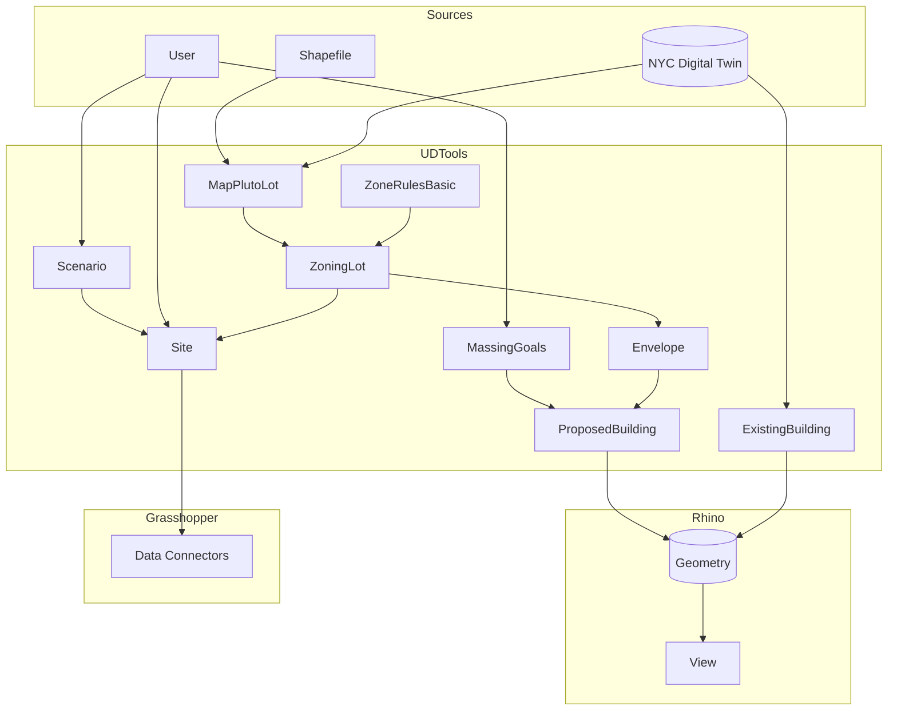
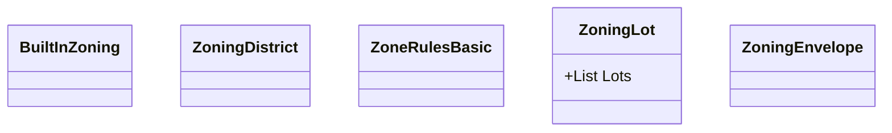
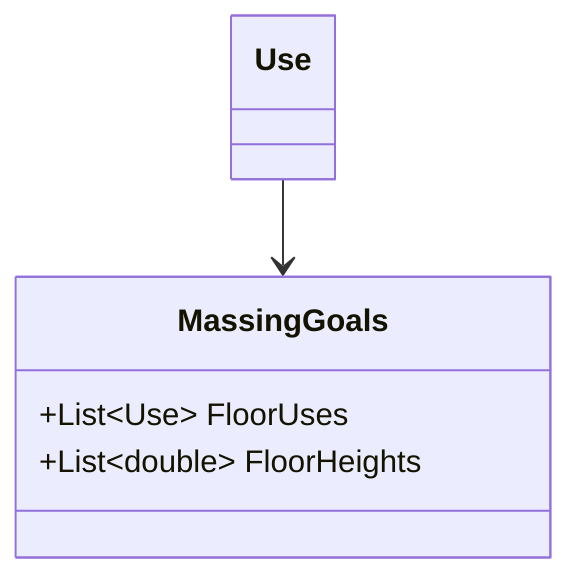
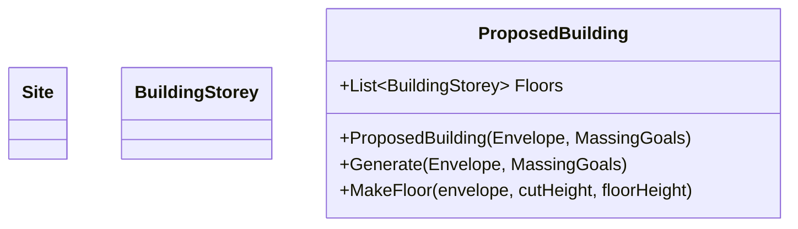

## Zoning

## Non-Zoning Parameters

## Proposed Building

Sites are processed differently in two special cases, triggered by Scenario ID. If the scenario name is "Existing", the ApplyPluto method will be called, and metrics will be calculated on the basis of the attributes of the site's MapPLUTO lots only. When the scenario name is "No Action," UDTools will first check to see if a Proposed Building is present on the site. If so, metrics will be calculated for the Proposed Building using ApplyModel; if not, ApplyPluto will be used instead. The ApplyModel method will be called in all other cases.