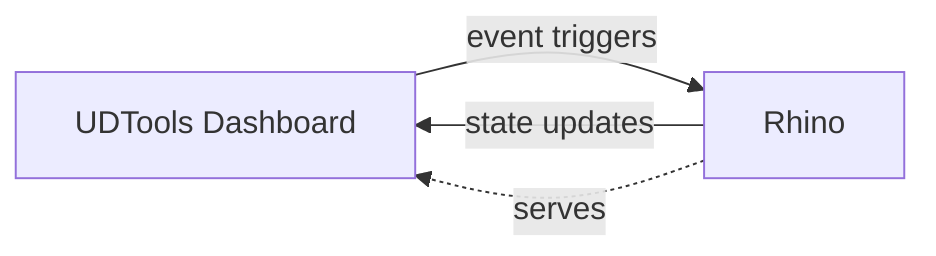

# UDTools UX Strategy

The UDTools "Dashboard" is a single-page web app implemented in React and served from the UDTools plugin instance running in Rhino. It is intended to reveal the current state of the UDTools plugin and to provide buttons, forms and other UI elements to trigger events in the running plugin in to allow an easy, intuitive user experience for beginning users.

Providing the dashboard as an SPA leaves open the possibility that UDTools could someday become independent from desktop Rhino and eventually use a server-based backend instead.

The Dashboard complements a full-featured command-line interface to interact with the plugin instance directly through Rhino and Grasshopper components to access the plugin's data model in a visual programming environment.
