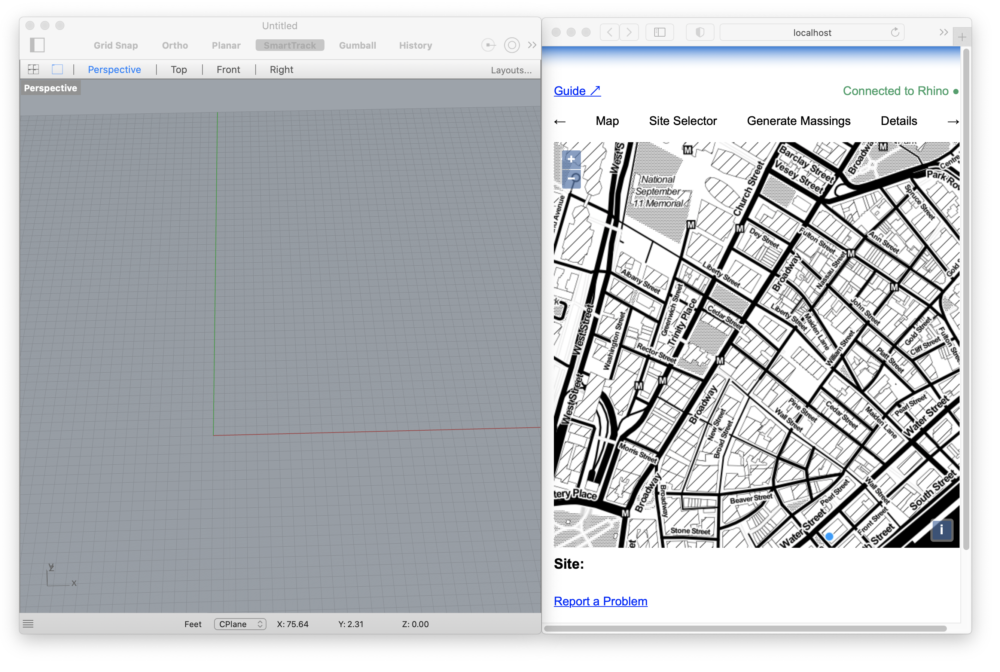
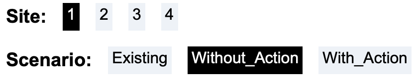
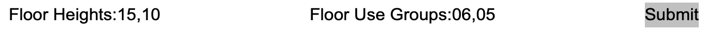
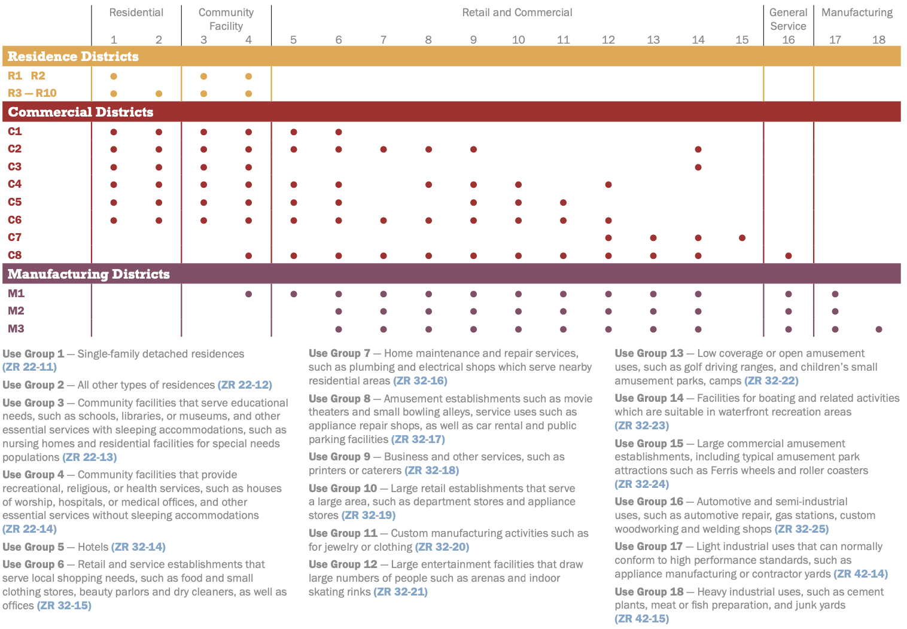
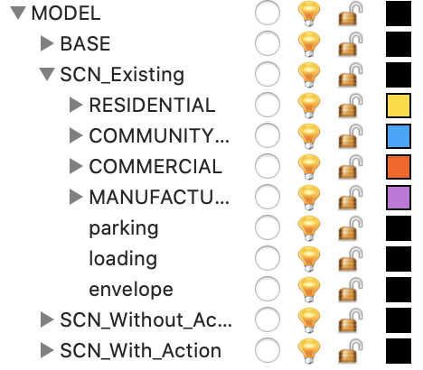
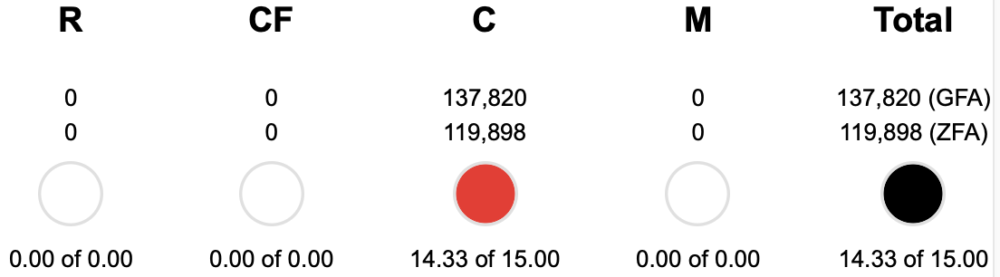

UDTools extends the functionality of Rhino to handle concepts specific to site development, zoning and urban design. It does this by adding new **commands** to help create and manipulate site models. If you're unfamiliar with using Rhino through commands, take a look at the [Rhino Basics](../learning/rhino-basics) page before proceeding.

It also provides a **Dashboard**, used to preview and manage the data embedded in the model in a more convenient way. The Dashboard runs in your web browser and maintains a connection to Rhino as you work and will stay in sync as your model changes.

After you've [installed](./install) UDTools, start Rhino and run `UD_Dashboard` to get started. Position the Dashboard window next to Rhino on your screen so you can see both at the same time.

## Context

Everything you can do with UDTools relies on a site model, based on the [NYC Digital Twin](../digital-twin/about). Each time you start a new project, UDTools can automatically fetch data from the Digital Twin and use it to build a site model for your project. You only need to do this step once for each project – when you save your Rhino file, the site model data will be included and will be available the next time you open it.

Using the map in the Dashboard, pan/zoom to your area of interest, then draw a line around the area you want to import.

Then, in Rhino, run the command `UD_ImportModel`. You'll see options to import the "map only", which will ignore the 3D ground surface and buildings, or to "flatten" which will place the 3D buildings on the ground plane. When making this choice, consider that 3D takes longer to fetch than 2D, and a large area will take longer to import than something small.

Click OK. When the command completes you should see the imported geometry added to your model.

## Setup

The next thing you'll need to do before you can start building and analyzing specific sites is tell UDTools where they are in space *and* time.

UDTools locates sites by associating them with an existing MapPLUTO tax lot by BBL. To handle time, it uses the concept of a *Scenario*, basically a specific moment in the past, present or future and the rules or assumptions that apply. Scenarios are defined by a label (e.g. Existing, No Action) and a zoning district.

This information is provided using a .CSV table, describing each site with:

- a unique **id** for the site
- a comma-separated list of tax **lots** by BBL
- a **zoning** district label for each scenario

Optionally, you can also specify a **group** and a **note**. A template `sites.csv` file is provided with each plugin release and can be edited with Excel, GIS software, or any plain-text editor.

Add sites to your model with the `UD_ImportSites` command, which will ask for the location of the table. UDTools will show a blue boundary around the site's zoning lot if successful.

Optionally, you can also provide overrides to the built-in zoning rules with another table. You'll also find a template `zoning.csv` file in the release folder. When using the built-in rules, you'll need to make sure that the zoning defined for each scenario in your sites table matches one of the currently-supported districts. If you're using overrides, make sure your scenario zoning matches the ID of one of the districts defined in the zoning table.

## Build

Now that you're ready to start building on your sites, you have two options. First, UDTools can help produce models for you. It aims to combine the convenience of a fully-automatic process with the flexibility to make manual adjustments when needed. You can also model completely by hand and use the measurement functions described below as a modeling aid.

Either way, you'll first need to select a specific site and the scenario you want to work on using the Site/Scenario toggles in the Dashboard.

A zoning envelope for the selected site can be generated by running `UD_GenerateEnvelope`.

To produce a full building massing, you'll first need to define "Massing Goals" for the site. Input a comma-separated list of floor heights and use groups in the Massing Goals Dashboard panel. The last item in each list will automatically repeat until all available FAR is exhausted. If no FAR is available for a specified use, nothing will be generated.

  

The Use Group chart from the Zoning Handbook is reproduced here for convenience:

 

Then you can run `UD_GenerateMassing` which will add a building massing and envelope to the selected site under the appropriate Scenario layer.

When modeling by hand, you're free to do whatever you want as long as you follow two basic rules. First, only closed polysurfaces with planar faces will be counted for floor area. Second, scenario and use are defined by layer, so be very careful that your model geometry is assigned to the correct layer.

 

If a given scenario doesn't have the full layer hierarchy shown above, you can generate it by running `UD_CheckLayers`.

<!-- If you need to create new layers to denote additional uses, the following naming convention and hierarchy must be observed:

- `MODEL` contains all geometry representing a 'real' physical or legal thing.
  - `BASE` is generated automatically when you run `UD_ImportModel`
  - Scenario layers, `SCN_Scenario_Name` contain all geometry particular to a given scenario. Examples: `SCN_Existing`, `SCN_No-Action`, `SCN_Proposal-2`. `SCN_Existing` and `SCN_No-Action`/`SCN_Without-Action` are special cases that pull floor area data from MapPLUTO instead of the model based on the requirements of the RWCDS analysis.
    - `envelope` contains volumes representing the maximum allowable bulk under the Scenario's zoning.
    - `RESIDENTIAL`, `COMMERCIAL`, `COMMUNITYFACILITY` and `MANUFACTURING` group together sublayers with each specific use
      - Specific uses are coded as `NN_use-label` where NN is a zero-padded number corresponding with a use code in the ZR and use-label is an arbitrary tag that can be used to track groups of floor area for non-zoning purposes. Examples: `02_condo`, `16_auto-related`, `06_office`, `06_local-retail` -->

## Measure

Every time the selection changes in Rhino, UDTools will recalculate the development metrics for the selected scenario, and preview them in the Dashboard panel shown below:

  

Here we can see that the selected site is utilizing 14.33 of 15 Commercial FAR available, or a Gross Floor Area of 137,820 sqft. The data shown in the dashboard is just a small subset of what's available from UDTools. You can use the `plugin-data-basic.gh` Grasshopper file provided in the release examples to explore more of what's available, or follow the steps to export a scenario table below.

## Export

If you want to use the data contained in the model with another program (like Excel) or share it with another member of the project team, it can be exported to a file with `UD_ExportScenario`. Rhino will prompt you for a file path, navigate to the desired location and name the file `your-file.csv` (you must provide the extension yourself). All sites under the currently-selected scenario will be exported.
