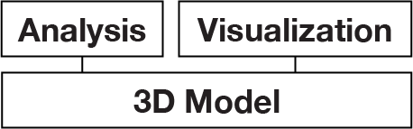
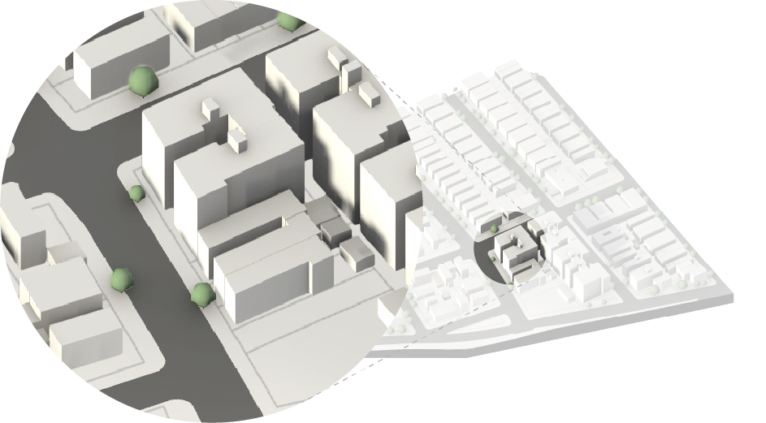

**Digital Practice Initiative Update**

### Urban Design → Strategic Planning

3/19/2020

---

### **Mission**

Promote the use of:

-   3D Modeling
-   Geospatial Data
-   Modern Web Development

To...

-   Increase efficiency
-   enhance awareness of NYC\'s built environment
-   facilitate conversations with constituents

Within the Urban Design Office and the agency as a whole

---

### **Agency Objectives**

SHOW ALIGNMENT W RELEVANT AGENCY OBJECTIVES

---

### **Background: NYC 3D Model**

-   ✅ Allows for neighborhood-scale visualization and analysis in three
    dimensions
-   ✅ Substantial public engagement and use through open data
-   ❌ Took 2 interns + mgmt entire summer to produce
-   ❌ No way to guarantee data used is best available
-   ❌ Large, unweildy files discourage casual use

---

### **Background: Parametric Tool**

-   ✅ Rapid prototyping 3D analysis and visualization tools
-   ✅ Successful application to three neighborhood studies
-   ✅ Substantial efficiency gains over previous manual modeling process
-   ❌ Extremely difficult to debug and maintain
-   ❌ Poorly documented, knowledge was lost in DVB/XL → CR transition
-   ❌ Decreases dependency on planner modeling skill but introduces
    steep learning curve for other aspects of the process

---

### **Goals**

-   Lower barriers to access, identify additional use cases
-   Identify new opportunities for impact with the help of an
    agency-wide steering committee
-   Enhance reliability and accuracy of existing zoning analysis
    functions
-   Continue ongoing coordination efforts to build capacity
-   Prioritize objectives to be better aligned with agency needs and
    priorities arising from anticipated budget shortfall and COVID
    recovery efforts

---

### **Work Plan**

1.  Toward a \"Living\" 3D Model
2.  Tools for Analysis
3.  Visualization & Outreach

---

### **Toward a \"Living\" 3D Model**

-   3D Model is the foundation for all other analysis and visualization
    work
-   Use the best and most recent geospatial data through cloud databases
    and APIs
-   Provide access to geometry and attributes directly within Rhino
-   Automate updates to public 3D Model of NYC

---

### **Toward a \"Living\" 3D Model**

-   ✅ Tax Lots (MapPLUTO)
-   ✅ 3D Buildings, identified by DOB BIN
-   ✅ 3D Topography, elevation accurate to +/- 1'
-   ✅ Sidewalks
-   ✅ Roadbeds
-   ✅ Street Trees
-   Latest Zoning Boundaries and Overlays
-   Census data (in process)
-   Known projects DB, Facilities DB (in process)

---

### **Tools for Analysis: Neighborhood Studies**

-   Builds on previous "Parametric Tool"
-   
-   Provide access to geometry and attributes directly within Rhino
-   Automate updates to public 3D Model of NYC

-   Coordinate with Data Engineering, GIS, Capital Planning, HED and
    other agencies to identify and incorporate additional datasets.
-   Provide input and guidance on acquisition and maintenance of new 3D
    data and recurring updates
-   Engage with public user base to develop new features and,
    potentially, crowdsource model data

---

### **Tools for Analysis: Single-Site**

-   3D Model is the foundation for all other analysis and visualization
    work
-   Use the best and most recent geospatial data through cloud platforms
    and APIs
-   Provide access to geometry and attributes directly within Rhino
-   Automate updates to public 3D Model of NYC

-   Coordinate with Data Engineering, GIS, Capital Planning, HED and
    other agencies to identify and incorporate additional datasets.
-   Provide input and guidance on acquisition and maintenance of new 3D
    data and recurring updates
-   Engage with public user base to develop new features and,
    potentially, crowdsource model data

---

### **Tools for Analysis: Other**

-   Using open-source Grasshopper plugins, we can also perform:
-   Shadow analysis
-   Environmental analysis & building performance
-   Pedestrian flow simulations

---

### **Visualization & Outreach: Drawings & Animations**

The model can be used to produce complex neighborhood-scale drawings and
animations much more quickly than with manual modeling methods. This
allows designers to focus more time and energy on drawing what matters.

---

### **Visualization & Outreach: Models**

It can also be used to produce machine-made physical models, quickly and
cheaply.

---

### **Visualization & Outreach: Web**

Using a cloud-based data backend will allow us to develop interactive,
3D web features for constituents that pull from a single source.

---

### **Stakeholders**

**Core Team & Leadership**

-   Claudia Herasme
-   Erick Gregory
-   Carsten Rodin
-   Crystal Eksi

**Users**

-   Urban Design Office
-   Borough Urban Designers

**Collaborators**

-   Zoning Division
-   Tom Smith
-   Lara
-   Communications
-   TRD
-   EARD
-   Data Engineering: Amanda Doyle
-   GIS: Matt Croswell
-   Planning Labs

**Steering Committee**

Provide feedback & guidance every 3 months re: agency goals and
priorities. Facilitate coordination and interdivisional work.

-   Executive Office
-   Strategic Planning
-   Directors
-   Ryan Blair/Application Development
-   Enterprise Data Management
-   Planning Labs
