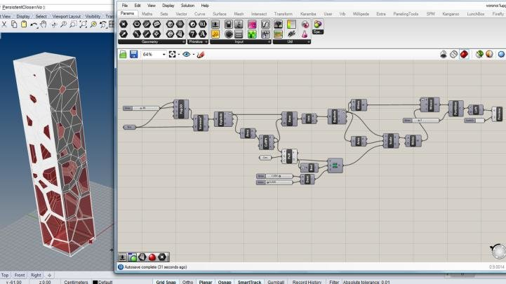

# Data-Driven Modeling in Rhinoceros with ~~CARTO~~ PostGIS

5/21/2020

---
### **Urban Design Digital Practice Initiative**

Promote the use of:

-   3D Modeling Software (Rhino)
-   Geospatial Data
-   Modern Web Development Tools

In order to:

-   Streamline time-consuming modeling and analysis workflows
-   Enhance awareness of NYC\'s built environment
-   Increase transparency and engage the public

---

---
### **NYC 3D Model**

Rhino files of each NYC Community District with 3D buildings and 2D
planimetric data (sidewalks, parks, subways) released in 2018 by the
Urban Design Office.

-   ✅ Allows for neighborhood-scale visualization and analysis in three
    dimensions.
-   ✅ Large and engaged user base.
-   ❌ Took 2+ staff members months to produce.
-   ❌ Hard to ensure data used is best available.
-   ❌ Large files discourage casual use.

---
### **Parametric Tool**

Grasshopper script to generate zoning-compliant building massings,
preview and export floor area data by use.

-   ✅ Rapid development of 3D geometry algorithms.
-   ✅ Successfully applied to three neighborhood studies.
-   ✅ Huge efficiency gains compared with earlier methods.
-   ✅ Decreases dependency on 3D modeling skills & zoning knowledge.
-   ❌ Extremely difficult to debug and maintain.
-   ❌ Poorly documented, knowledge was lost in staff transition.
-   ❌ Steep learning curve for new users.

---
### **What is Grasshopper?**

-   Visual programming environment inside Rhino 3D
-   Great for prototyping 3D algorithms
-   Not a good way to build production software!
-   Best used as a way for Rhino users to quickly build minor
    enhancements to Rhino\'s functionality

---

### **Goals**

-   Lower barriers to entry
-   Expand applicability of modeling tools to diverse workstreams
-   Integrate with DCP-produced spatial data products + other OpenData
    sources
-   Do more with less
-   Documentation!

---
### **Work Plan**

Gradually working toward those goals through three separate but related
workstreams, starting with the first:

1.  A \"Living\" 3D Model ⭐️
2.  Tools for Analysis
3.  Visualization & Outreach

---
### **Toward a \"Living\" 3D Model**

-   3D Model is the foundation for all other analysis and visualization
    work
-   Use the best and most recent geospatial data through cloud databases
    and web APIs
-   Provide access to geometry and attributes directly within Rhino
-   Lay the groundwork for public-facing 3d web app
-   Automate future updates to publicly released 3D Model of NYC

---
### **Ingredients**

-   ✅ 3D ground surface from LIDAR
-   ✅ Tax Lots (MapPLUTO)
-   ✅ 3D Buildings
-   ✅ Shoreline
-   ✅ Sidewalks
-   ✅ Roadbeds
-   ✅ Street Trees

-   Zoning Boundaries and Overlays
-   Census data from API
-   Known Projects and Facilities Databases
-   Street Furniture
-   Procedurally-Modeled Building Facades

---

### **How Does It Work?**

-   \"3D Model\" is really just a euphemism for a database.
-   PostGIS: extension to PostgreSQL that allows for complex spatial
    queries expressed as SQL.
-   CARTO wraps this and provides as a web service.
-   But since it targets 2D web maps, it strips away most of the 3D
    functionality in PostGIS.
-   You also can\'t choose what coordinate system you use.
-   Finally, DCPBuilder setup isn\'t a great way to manage
    mission-critical work.
-   Monday-morning data crisis this week was the end of the CARTO
    experiment.
-   UDTools Rhino plugin, developed in .NET.
-   Makes SQL queries for different layers, converts geometry to Rhino
    objects.
-   Also holds attribute data for buildings (BBL identifier) and
    MapPLUTO lots.

---

### **Analysis: Zoning**

A well-developed spatial data infrastructure allows for more accurate
and complex zoning algorithms. Factors like height of adjacent
buildings, street wall continuity and base plane elevation can be taken
into account.

---
### **Analysis: Environmental**

Using open-source Grasshopper plugins, we can use the model for:

-   Shadow analysis
-   Context-dependent environmental analysis & building performance
    evaluation
-   Pedestrian flow simulations

---

### **Visualization: Drawings & Animations**

The model can be used to produce complex neighborhood-scale drawings and
animations much more quickly than with manual modeling methods. This
allows designers to focus more time and energy on drawing what matters.

[MVRDV]{.small}

---
### **Visualization: Models**

It can also be used to produce machine-made physical models, quickly and
cheaply.

---

### Visualization: Web

Using a cloud-based data backend will allow us to develop interactive,
3D web features for constituents that pull from a single source.

Really exciting things are happening right now in the 3D web development
space, easier than ever to build interactive 3D features.

---

## Demo

---

<iframe src="https://player.vimeo.com/video/421580130" width="720" height="480" frameborder="0" allow="autoplay; fullscreen" allowfullscreen></iframe>

---

<iframe src="https://player.vimeo.com/video/421580050" width="720" height="480" frameborder="0" allow="autoplay; fullscreen" allowfullscreen></iframe>

---

<iframe src="https://player.vimeo.com/video/421580219" width="720" height="480" frameborder="0" allow="autoplay; fullscreen" allowfullscreen></iframe>

---

<iframe src="https://player.vimeo.com/video/421580296" width="720" height="480" frameborder="0" allow="autoplay; fullscreen" allowfullscreen></iframe>

---

<iframe src="https://player.vimeo.com/video/421579605" width="720" height="480" frameborder="0" allow="autoplay; fullscreen" allowfullscreen></iframe>

---

<iframe src="https://player.vimeo.com/video/421580130" width="720" height="480" frameborder="0" allow="autoplay; fullscreen" allowfullscreen></iframe>

---

### What's Next?

-   Overhaul massing generator & zoning analysis tools
-   Develop documentation & training materials
-   Digital drawing workflows for UD team
-   3D web app
-   Ideas?

