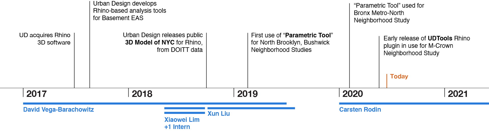
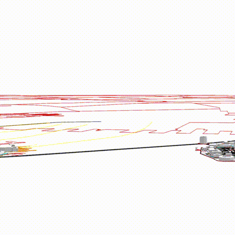
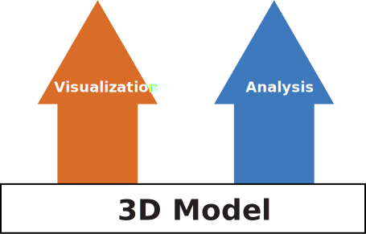
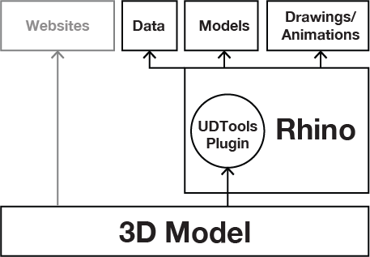
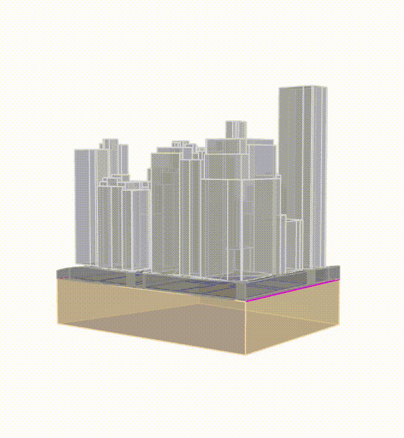
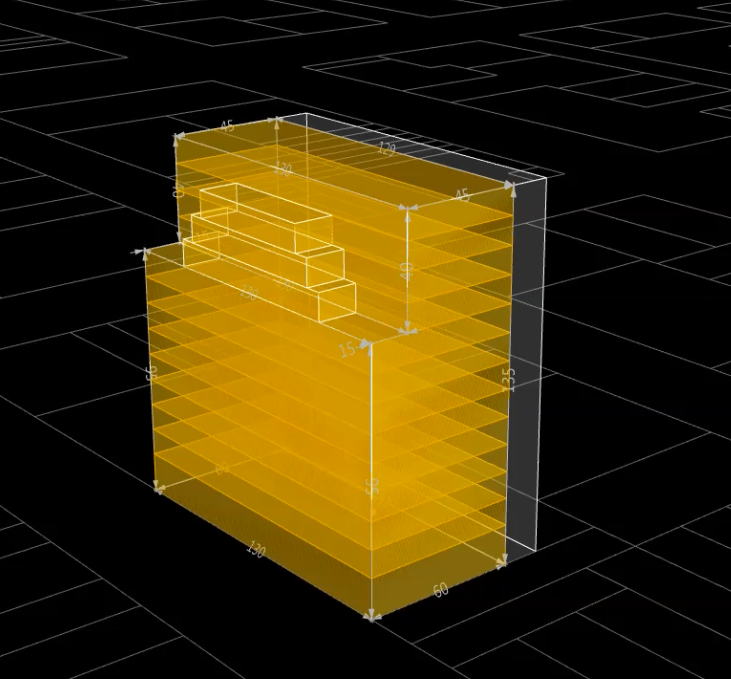
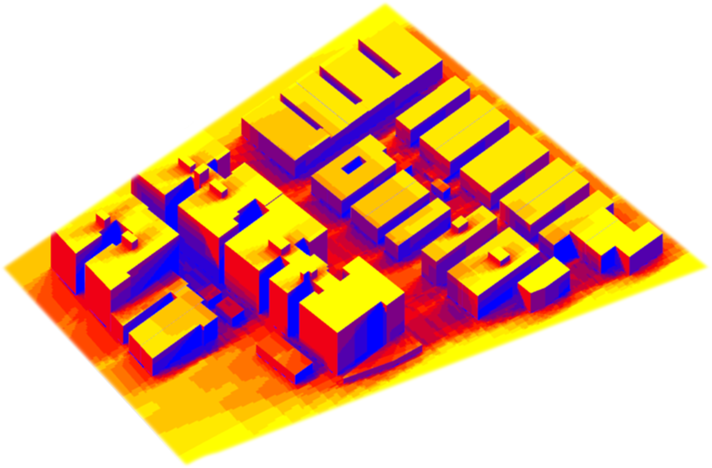
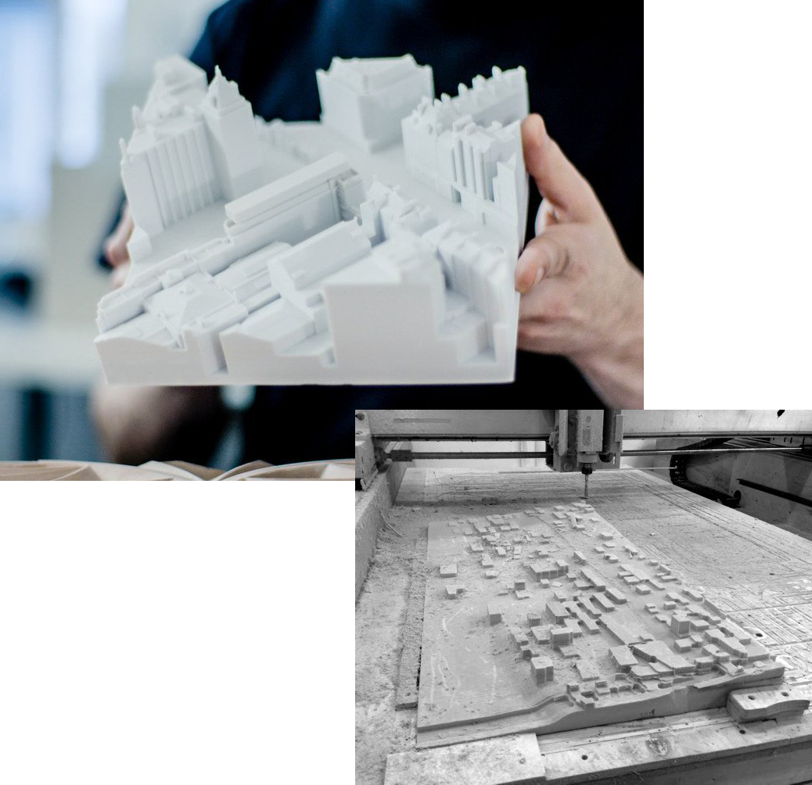

# UD Digital Practice Update

Update → Strategic Planning  
*(Delivered 5/28/2020)*  

---

## What is the DPI?

Promote the use of:

- 3D Modeling Software (Rhino)
- Geospatial Data
- Modern Web Development Tools

In order to:

- Streamline time-consuming modeling and analysis workflows
- Enhance contextual awareness to guide decision-making
- Increase transparency and engage the public

Within the Urban Design Office and the agency as a whole

---

---

## NYC 3D Model

Rhino files of each NYC Community District with 3D buildings and 2D planimetric data (sidewalks, parks, subways) released in 2018 by the Urban Design Office.

- ✅ Easy 3D visualization of NYC's built environment.
- ✅ Large and engaged user base.
- ❌ Time-consuming to produce.
- ❌ Hard to ensure data used is best available.
- ❌ Large files discourage casual use.

---

## Parametric Tool

Grasshopper script to generate zoning-compliant building massings, preview and export floor area data by use.

- ✅ Huge productivity gains compared with earlier methods.
- ✅ Successfully applied to three neighborhood studies.
- ✅ Decreased dependency on 3D modeling skills & zoning knowledge.
- ❌ Difficult to maintain.
- ❌ Knowledge loss in 2019-2020 staff transition.
- ❌ Steep learning curve for new users.

---

## Parametric Tool

What is Grasshopper?

- Visual programming environment inside Rhino 3D
- Great for prototyping 3D algorithms
- Poor support for attribute-heavy spatial data
- Hard to track/organize incremental improvement
- Best for user-defined, project-specific custom tools

---

## Goals

- Lower barriers to entry
- Expand applicability of modeling tools to diverse workstreams
- Integrate with DCP-produced spatial data products + other OpenData sources
- Identify opportuntities for collaboration including with outside contributors
- Prioritize objectives to be better aligned with agency needs and priorities, esp. post-COVID

---

## Work Plan

Gradually working toward those goals through three separate but related workstreams, starting with the first:

- A "Living" 3D Model ⭐️
- Tools for Analysis
- Visualization & Outreach

---

## Toward a Living 3D Model

- 3D Model is the foundation for all other analysis and visualization work
- Use the best and most recent geospatial data through cloud databases and web APIs
- Provide access to data directly from Rhino for in-house work
- Automatic updates to public 3D Model release
- Lay the groundwork for public-facing 3d web app

---

## Ingredients

- ✅ 3D ground surface from LIDAR
- ✅ Tax Lots (MapPLUTO)
- ✅ 3D Buildings
- ✅ Shoreline
- ✅ Sidewalks
- ✅ Roadbeds
- ✅ Street Trees
- Zoning Boundaries and Overlays
- Census data from API
- Known Projects and Facilities Databases
- Street Furniture
- Procedurally-Modeled Building Facades

---

## Analysis: Zoning

A well-developed spatial data infrastructure allows for more accurate and complex zoning algorithms. Factors like height of adjacent buildings, street wall continuity and base plane elevation can be taken into account.

---

## Analysis: Environmental

Using open-source Grasshopper plugins, we can use the model for:

- Shadow analysis
- Context-dependent environmental analysis & building performance evaluation
- Pedestrian flow simulations

---

## Visualization: Drawings & Animations

The model can be used to produce complex neighborhood-scale drawings and animations much more quickly than with manual modeling methods. This allows designers to focus more time and energy on drawing what matters.

<cite>MVRDV</cite>

---

## Visualization: Models

It can also be used to produce machine-made physical models, quickly and cheaply.

---

## Visualization: Web

Using a cloud-based data backend will allow us to develop interactive, 3D web features for constituents that pull from a single source.

Really exciting things are happening right now in the 3D web development space, easier than ever to build interactive 3D features.

<cite>Immersive Garden</cite>

---

## Demo

---

<iframe title="vimeo-player" src="https://player.vimeo.com/video/421580050" width="640" height="380" frameborder="0" allowfullscreen></iframe>

---

<iframe title="vimeo-player" src="https://player.vimeo.com/video/421580219" width="640" height="380" frameborder="0" allowfullscreen></iframe>

---

<iframe title="vimeo-player" src="https://player.vimeo.com/video/421580296" width="640" height="380" frameborder="0" allowfullscreen></iframe>

---

<iframe title="vimeo-player" src="https://player.vimeo.com/video/421579605" width="640" height="380" frameborder="0" allowfullscreen></iframe>

---

<iframe title="vimeo-player" src="https://player.vimeo.com/video/421580130" width="640" height="380" frameborder="0" allowfullscreen></iframe>

---

## What's Next?

- Overhaul massing generator & zoning analysis tools
- Develop documentation & training materials
- Digital drawing workflows for UD team
- 3D web app
- Ideas?

---

## Stakeholders

### Core Team & Leadership

- Claudia Herasme
- Erick Gregory
- Carsten Rodin
- Crystal Eksi

### Users

- Urban Design Office
- Borough Urban Designers

### Collaborators

- Zoning Division
- Neighborhood Studies
- Communications
- TRD
- EARD
- Data Engineering
- GIS
- Planning Labs

### Steering Committee

Provide feedback and guidance every 3 mos. Advise on agency goals and priorities. Facilitate coordination and interdivisional work.

- Executive Office
- Strategic Planning
- Directors
- Application Development
- Enterprise Data Management
- Planning Labs

---

## Thank You!

<!-- ## Slides are written in Markdown!

Here's the source of the first slide:

    # Gatsby Deck

    Create presentations using Gatsby & React. -->

<!-- > Inscrutable icons litter the face of the devices even though the research
> community has long demonstrated that people cannot remember the meaning of
> more than a small number of icons […] Who can remember what each icon
> means? Not me.
> <cite>Don Norman</cite> -->