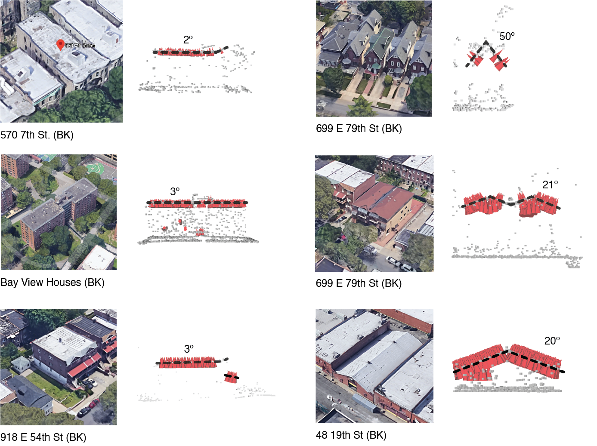

# MOS Energy Retrofit Check-In

Python-based 3D Spatial Analysis demo

<!--  -->

---

Steps:

- Fetch point cloud from PostGIS using building footprint or tax lot boundary
- Average Pitch: 14.51º

---

<!--IMAGEONLY-->

<!--  -->

---

Work-in-progress code can be found on [github](https://github.com/NYCPlanning/ud-analysis/blob/master/notebooks/2020-07-16_lidar-examples.ipynb)