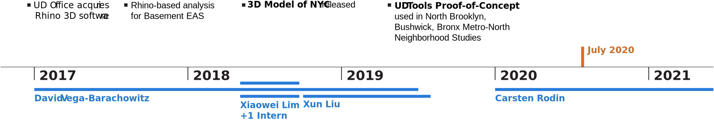
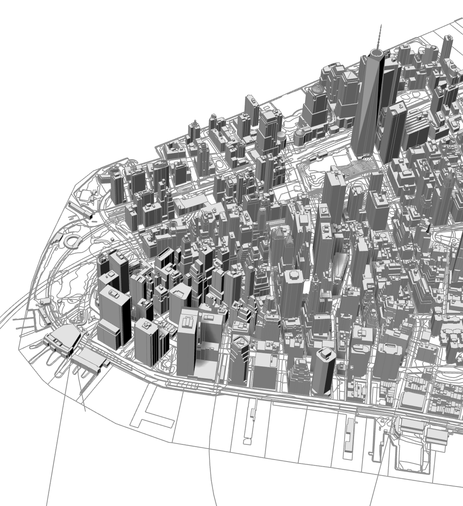
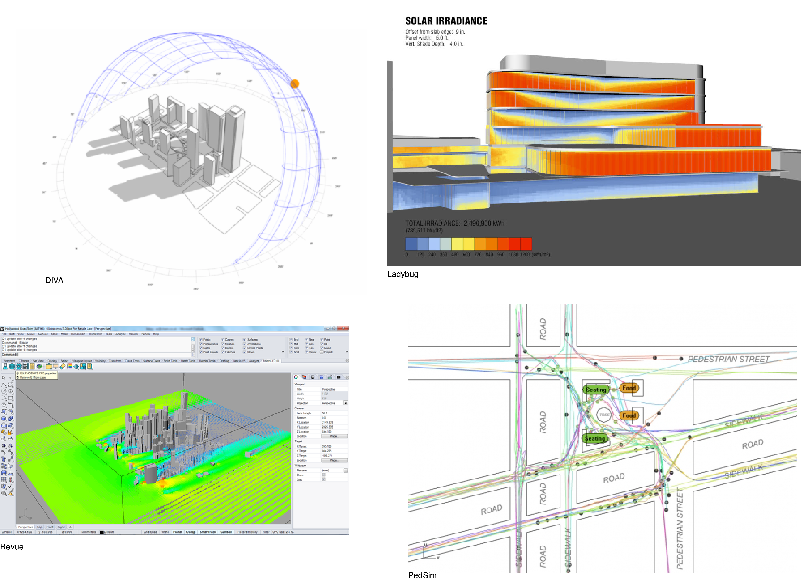
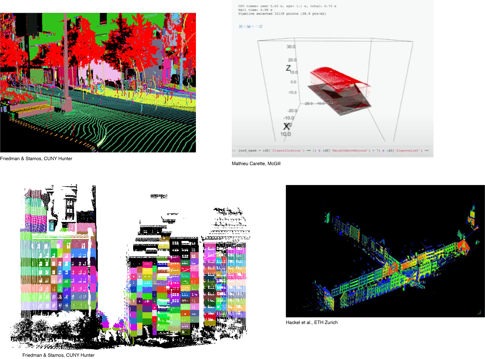
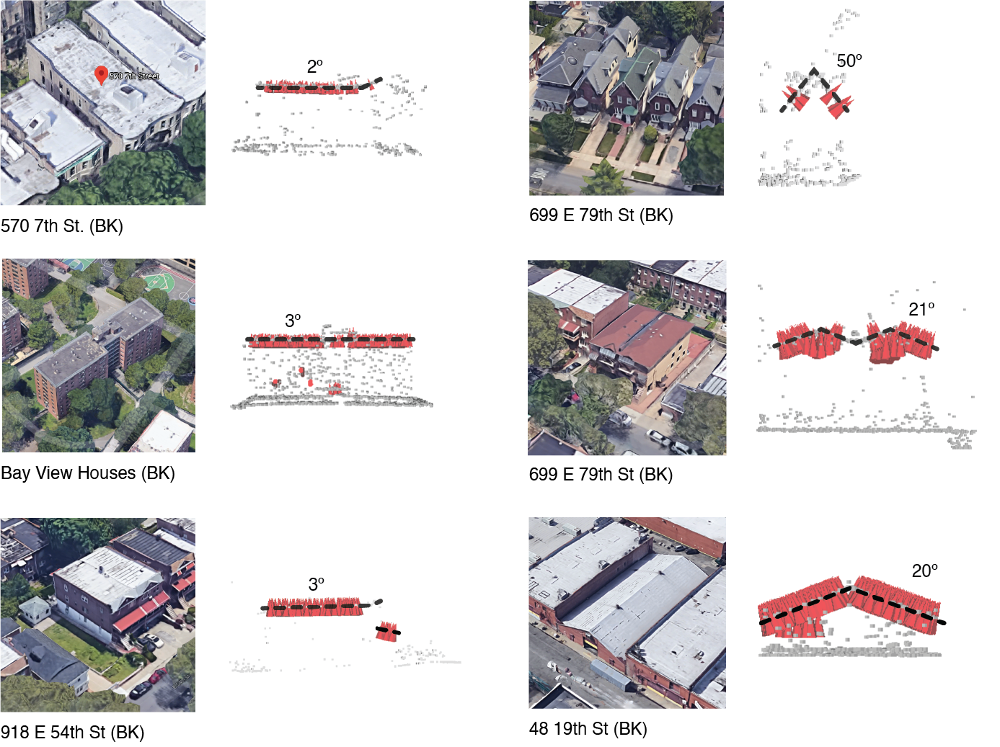
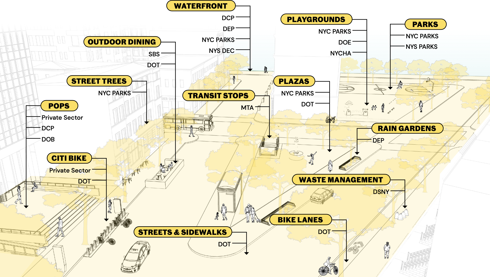
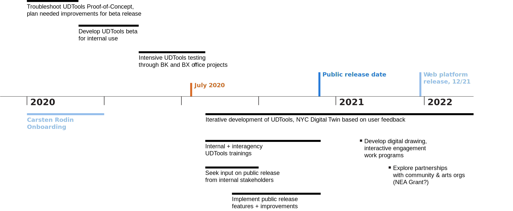
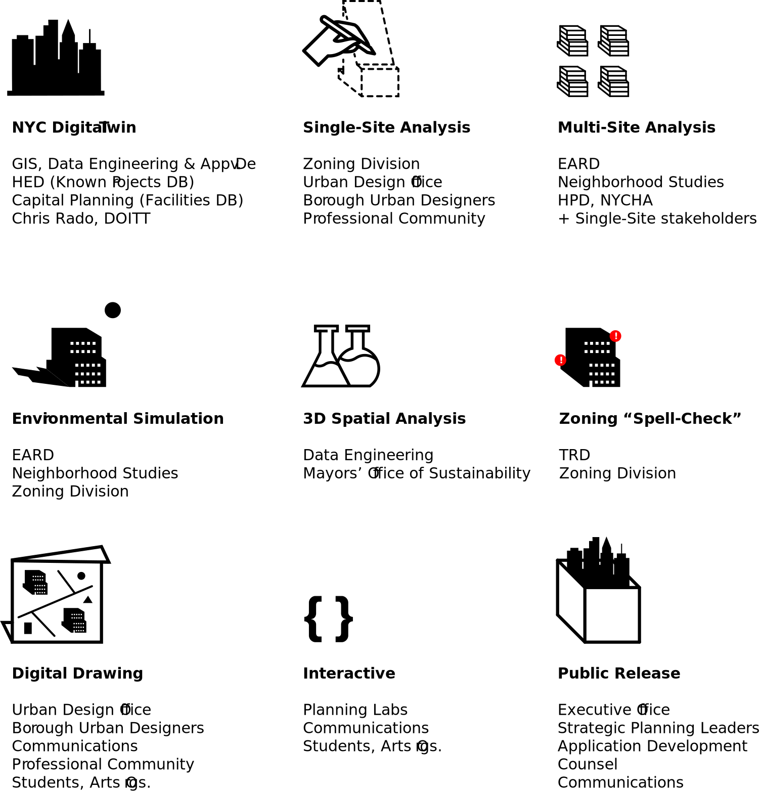

<!-- IMPORT LAYOUTS AND ADDITIONAL COMPONENTS TO INCLUDE -->
import ImageRight from '../../src/layouts/slides/imageRight';
import ImageAbove from '../../src/layouts/slides/imageAbove';
import Centered from '../../src/layouts/slides/centered';

<!-- END IMPORTS, BEGIN FIRST SLIDE -->

# Digital Practice Initiative

Update → Central UD Team

---

## What is the Digital Practice Initiative?

Aims to enhance the work of the Urban Design Office, and the agency as a whole, through the use of computational design **tools** & **data**.

- Expedite time-consuming modeling and analysis workflows
- Enhance contextual awareness to guide decision-making
- Increase transparency and engage the public

<!-- Tools: 3D modeling, gis/spatial data and frontend web technologies -->

---

---

<ImageRight>

**Parametric Tool**

✅ Cut analysis time by 90%  
✅ 3+ neighborhood studies  
❌ Difficult to maintain  
❌ Knowledge lost in last staff transition  
❌ Steep learning curve for new users  

</ImageRight>

---

<ImageRight>

**NYC 3D Model**

Downloadable Rhino files of each NYC Community District. Combines 3D building dataset from DOITT and 2D map data from other city sources, like sidewalks, parks, subway entrances.

✅ Convenient 3D view of the city  
✅ Released publicly through OpenData  
❌ Hard to produce  
❌ Hard to update  
❌ Large files discourage casual use  

</ImageRight>

---

<ImageAbove>

Environmental Simulation

</ImageAbove>

---

<ImageAbove>

Spatial Data Analysis

</ImageAbove>

---

<ImageAbove>

Spatial Data Analysis: Roof Shapes for MOS

</ImageAbove>

---

<Centered>

</Centered>

---

---

