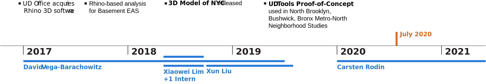
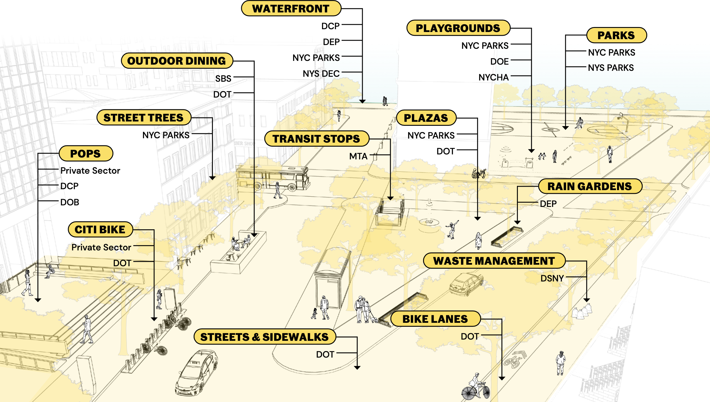
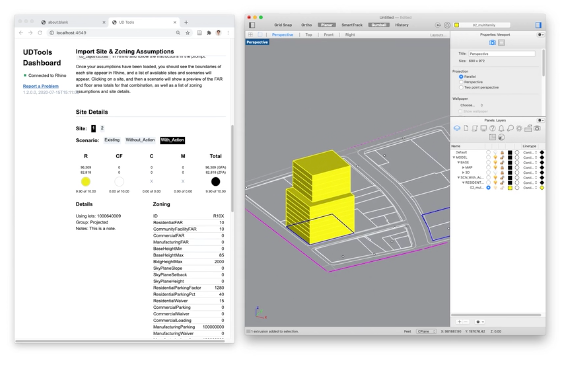
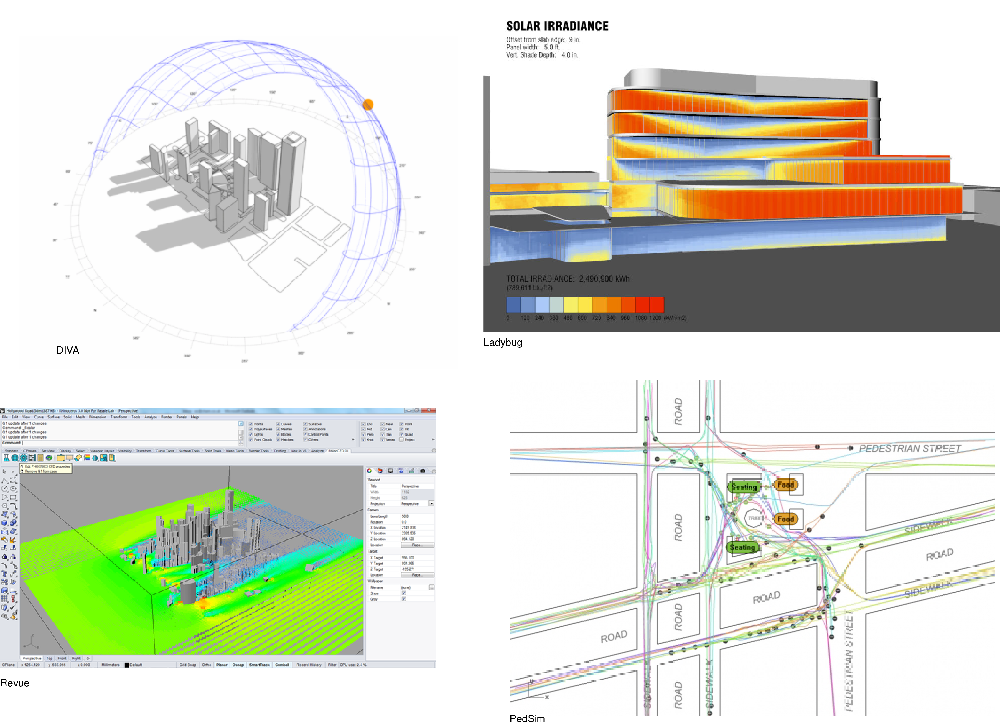
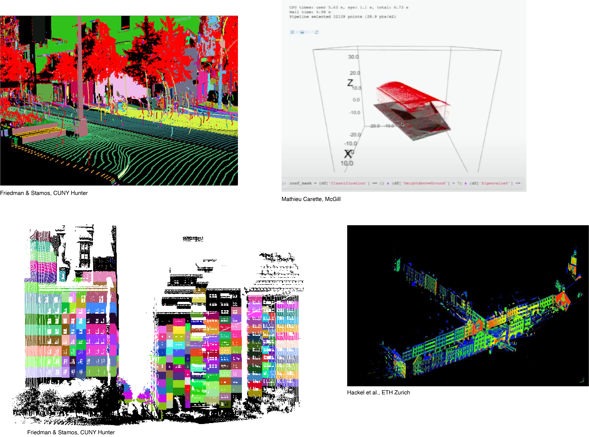
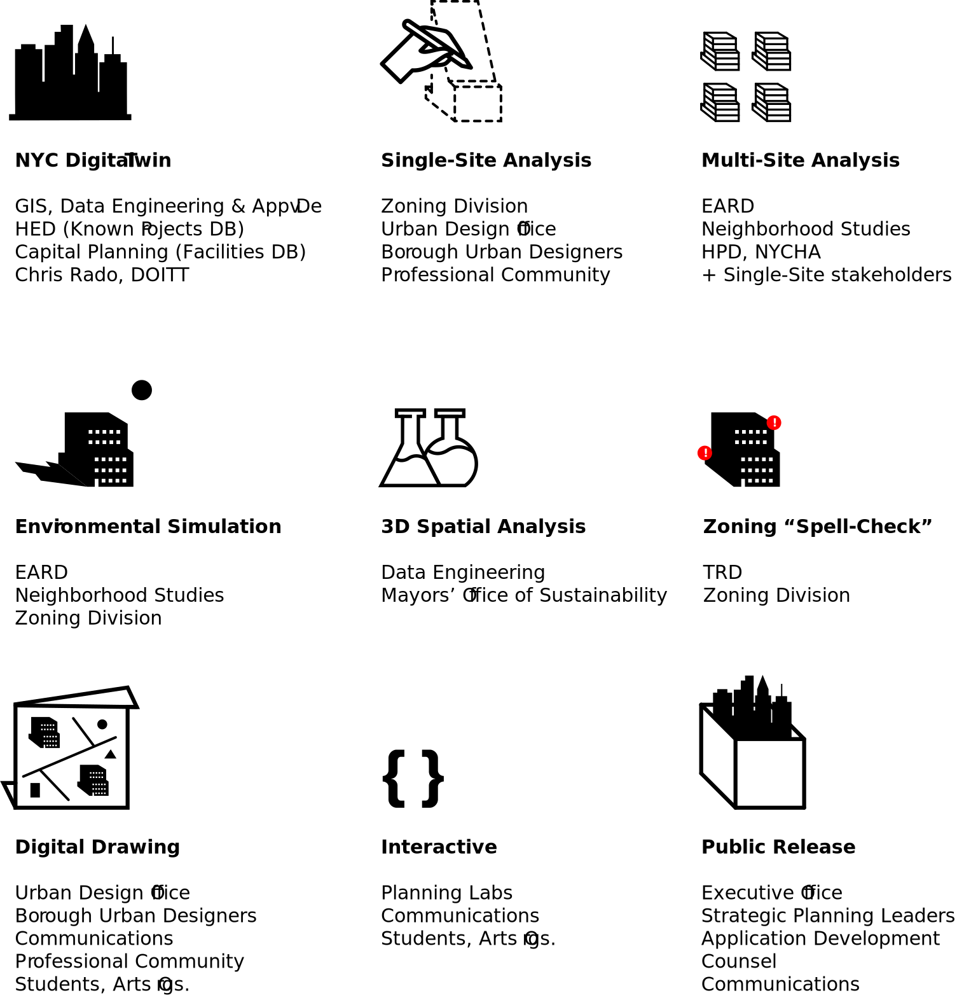

<!-- IMPORT LAYOUTS AND ADDITIONAL COMPONENTS TO INCLUDE -->
import ImageRight from '../../src/components/slides/imageRight';
import ImageAbove from '../../src/components/slides/imageAbove';
import Centered from '../../src/components/slides/centered';
import ThreeViewer from '../../src/components/threeViewer';

<!-- END IMPORTS, BEGIN FIRST SLIDE -->

# Digital Practice Initiative

Update → Central UD Team

---

<ImageRight>

## Goals

The Digital Practice Initiative aims to amplify and enhance the work of the Urban Design Office, through the use of computational design **tools** & **data**.

- Expedite time-consuming modeling and analysis workflows
- Enhance contextual awareness to guide decision-making
- Increase transparency and engage the public

</ImageRight>

<!-- Tools: 3D modeling, gis/spatial data and frontend web technologies -->

---

---

<ImageRight>

**NYC 3D Model**

~60 Rhino files by Community District

✅ Multiple datasets in a single source   
✅ Public impact through OpenData release  
❌ Hard to produce  
❌ Hard to update  
❌ Large files discourage casual use  

</ImageRight>

---

<ImageRight>

**NYC Digital Twin**

Provided as a live database service, not files

- Virtual replica of the real-world city
- Versioned data from specific sources
- Easy to update
- Access for Rhino, GIS, data science + web tools

</ImageRight>

---

<Centered>

</Centered>

---

<ImageRight>

**Parametric Tool**

✅ Cut analysis time by 90%  
✅ 3+ neighborhood studies  
❌ Difficult to maintain  
❌ Knowledge lost in last staff transition  
❌ Steep learning curve for new users  

</ImageRight>

---

<ImageRight>

**UDTools**

- Rhino plugin, builds on existing functions
- Fetch models from NYC Digital Twin
- Provides basic BIM-like handling of defined terms: Zoning Lot, Floor, Scenario etc.
- Evaluate zoning for different real-world sites
- Generate RWCDS massings
- Calculate development metrics (floor area/parking/unit counts)

</ImageRight>

---

<Centered>
<iframe src="https://player.vimeo.com/video/438591158" width="640" height="397" frameborder="0" allow="autoplay; fullscreen" allowfullscreen></iframe>
</Centered>

---

<Centered>
<iframe src="https://player.vimeo.com/video/421580130" width="640" height="380" frameborder="0" allow="autoplay; fullscreen" allowfullscreen></iframe>
</Centered>

---

<ImageAbove>

Environmental Simulation

</ImageAbove>

---

<ImageAbove>

Spatial Data Analysis

</ImageAbove>

---

<ImageAbove>

Spatial Data Analysis: Roof Shapes for MOS

</ImageAbove>

---

---

---

---

<ThreeViewer />
