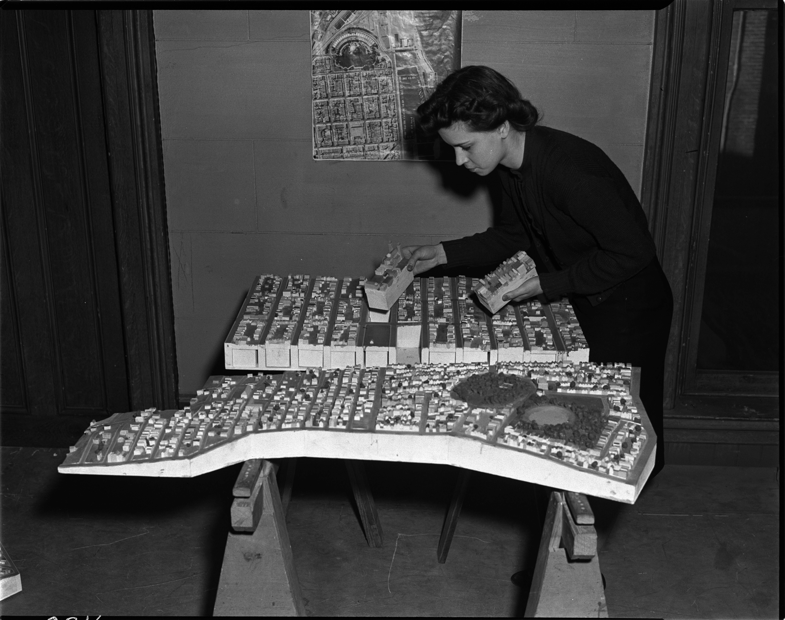
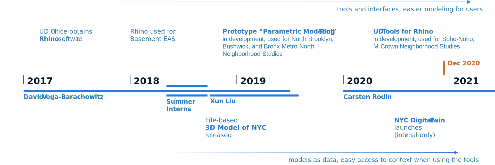

<!-- IMPORT LAYOUTS AND ADDITIONAL COMPONENTS TO INCLUDE -->
import ImageRight from '../../src/layouts/slides/imageRight';
import ImageAbove from '../../src/layouts/slides/imageAbove';
import Centered from '../../src/layouts/slides/centered';
import ThreeViewer from '../../src/components/threeViewer';
import Image from '../../src/layouts/slides/image';

<!-- END IMPORTS, BEGIN FIRST SLIDE -->

# Urban Design **Digital Practice Initiative**

Introduction → Counsel, Business Improvement

---

The **Digital Practice Initiative** (DPI) seeks to amplify and enhance the value of urban design and physical planning in NYC, through the development and dissemination of **tools**, **methods** & **data**.

<!-- 

Tools: 3D modeling, gis/spatial data and frontend web technologies 

Expedite time-consuming modeling and analysis workflows
Enhance contextual awareness to guide decision-making
Increase transparency and engage the public

-->

---

We have a vision for how **models** can help designers and planners be more context-aware, work more effectively, and communicate more vividly.

---

<Image caption={'Image: City of San Francisco'} mode={'center'}>

</Image>

---

<Image caption={'Image: Lucien Kroll'} mode={'center'}>

</Image>

---

<Image caption={'Image: Environmental Simulation Center'} mode={'center'}>

</Image>

---

<Image caption={'Image: Center for Urban Pedagogy'} mode={'center'}>

</Image>

---

Models, in general:

- Record and store information about places
- Are tangible/intuitive
- Allow us to experiment
- Keep everybody on the same page

---

*Digital* models can also reflect rules, behavior and change over time. This makes them a powerful tool for physical planning. They can help us:

- **Evaluate zoning**, in spatial terms
- **Quantify impact**
- **Coordinate consensus**

<!-- With a well-designed digital model, you can ask it a question and it will give you an answer. These last two points are particularly important for remote work! -->

---

Their main downside is they are *not* tangible/intuitive. Instead, specialized **tools** are needed to access **data**, using the appropriate **methods**.

<!-- These last two points are particularly important for remote work! -->

---

<!-- 

How is DCP doing on acheiving a high-quality modeling practice? These are some major milestones in the process we started back in 2017 when the UD office first obtained licenses for the Rhino 3D modeling software, the premiere digital modeling tool used in architecture, engineering and manufacturing.

-->

---

 
<!-- This chart shows staff changes, as well as developments in both the development of tools and data  -->

---

# **Products**

---

<ImageRight>

**NYC Digital Twin**

- Collects multiple Open Data layers in the same "place"
- Data from DCP EDM, DOITT, Parks, DOT and others
- Can be used in Rhino, GIS and the web
- Currently internal-only, but scaleable

</ImageRight>

<!-- 

This is the models-as-data piece

The original 3d model of nyc was released publicly, but was difficult to use, update and contained geometric information only, not fully digital in the sense we need.

The digital twin contains information about street widths, overlays and more that can be read by software and used to better "model" zoning constraints and more

- Provided as a live database service, not files
- Virtual replica of the real-world city
- Versioned data from specific sources
- Easy to update

 -->

---

<ImageRight>

**UDTools**

- Adds new functionality to Rhino
- Fetches models from NYC Digital Twin
- Evaluates zoning based on context
- Calculates key development metrics
- Saved file provides a single "source of truth" on large/complex projects

</ImageRight>

<!-- 

This is where the "rubber meets the road"

**Parametric Tool**

✅ Cut analysis time by 90%  
✅ 3+ neighborhood studies  
❌ Difficult to maintain  
❌ Knowledge lost in last staff transition  
❌ Steep learning curve for new users  

 -->

---

<Image caption={''} mode={'center'}>

</Image>

---

<Image caption={''} mode={'center'}>

</Image>

---

<Image caption={''} mode={'center'}>

</Image>

---

<Image caption={''} mode={'center'}>

</Image>

---

A model-based approach can support diverse uses beyond the RWCDS:

- Environmental simulation
- Spatial data analysis
- Interactive web features

<!-- 
<ImageAbove>

Environmental Simulation

</ImageAbove>

<ImageAbove>

Spatial Data Analysis

</ImageAbove>

<ImageAbove>

Spatial Data Analysis: Roof Shapes for MOS

</ImageAbove>

 -->

---

# **Broadening Impact**

---

DPI's products are designed for NYC, and built around DCP's requirements. But their potential value extends beyond the agency.

---

We want to better understand how we can maximize value to the agency and the public in three different arenas:

- Within city government
- At the "public-private interface"
- In the NYC design community and public at large

In each context, we especially want to consider:

- Who are the potential users?
- Who can contribute?

---

Things we're considering:

- Adopting an open-source development model to work with outside contributors
- Launching a pilot program to explore possibilities for consultant coordination
- Parnering with NYC tech companies to co-develop the Digital Twin
- Offering our products to the public for a fee
- Building our user base through partnerships with design schools

---

# **Thank You**

---

<!-- 
<ThreeViewer scene='/blocks.glb' />

 -->
