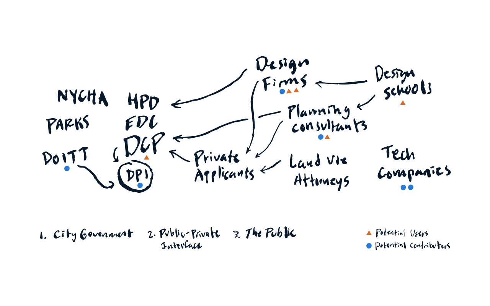
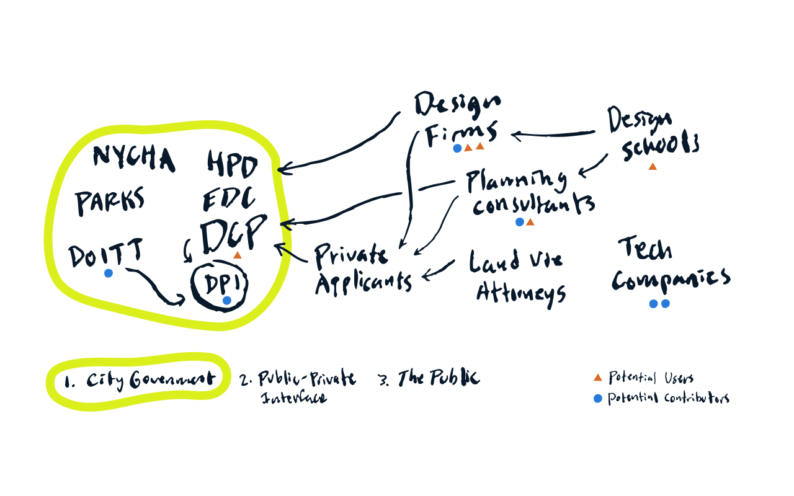
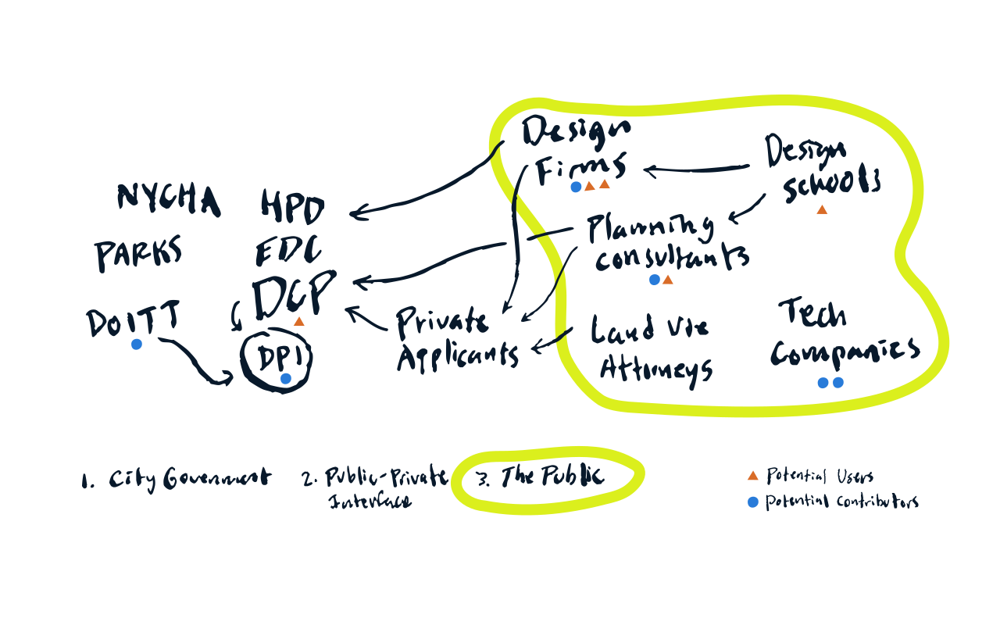

<!-- IMPORT LAYOUTS AND ADDITIONAL COMPONENTS TO INCLUDE -->

import ImageRight from '../../src/layouts/slides/imageRight';
import ImageAbove from '../../src/layouts/slides/imageAbove';
import Centered from '../../src/layouts/slides/centered';
import ThreeViewer from '../../src/components/threeViewer';
import Image from '../../src/layouts/slides/image';
import SVGInteractive from '../../src/components/svgInteractive';

<!-- END IMPORTS, BEGIN FIRST SLIDE -->

# Urban Design **Digital Practice Initiative**

Introduction → Counsel, Business Improvement

---

The **Digital Practice Initiative** (DPI) seeks to amplify and enhance the value of urban design and physical planning in NYC, through the development and dissemination of **tools**, **methods** & **data**.

---

We have a vision for how **models** can help designers and planners be more context-aware, work more effectively, and communicate more vividly.

---

<Image caption={'Image: City of San Francisco'} mode={'center'}>

</Image>

---

<Image caption={'Image: Lucien Kroll'} mode={'center'}>

</Image>

---

<Image caption={'Image: Environmental Simulation Center'} mode={'center'}>

</Image>

---

<Image caption={'Image: Center for Urban Pedagogy'} mode={'center'}>

</Image>

---

Models, in general:

- Record and store information about places
- Are tangible and intuitive
- Allow us to experiment
- Keep everybody on the same page

---

*Digital* models do even more. They're much more powerful when it comes to answering questions. In urban design and physical planning, they can help:

- **Evaluate zoning**
- **Quantify impact**
- **Coordinate consensus**

---

Unfortunately they're less intuitive to work with than physical models. Digital modeling (as a *practice*) involves specialized **tools**, used together with the right **methods**, to access and manipulate **data**.

**The overarching goal of this work is to make dealing with digital models as easy as possible.**

---

---

---

# **Products**

---

<ImageRight>

**NYC Digital Twin**

- Collects multiple Open Data layers in the same place
- Data from DCP, DOITT, Parks, DOT and others
- Provides the basis for spatial understanding of zoning

</ImageRight>

---

<ImageRight>

**NYC Digital Twin**

- Collects multiple Open Data layers in the same place
- Data from DCP, DOITT, Parks, DOT and others
- Provides the basis for spatial understanding of zoning

**DCP is in a singular position to build and maintain this** because it is:

- Specific to NYC
- Based on our own data products (MapPLUTO)
- Not a "scalable" project

</ImageRight>

---

<ImageRight>

**UDTools**

- Adds new functionality to Rhino
- Retrieve data from NYC Digital Twin
- Evaluate zoning in 3D, based on context
- Generate RWC development models
- Calculate impact from key metrics in real time
- Saved file provides a single "source of truth" on large/complex projects

</ImageRight>

---

<Image caption={'1. Set Context'} mode={'center'}>

</Image>

---

<Image caption={'2. Set Site Locations'} mode={'center'}>

</Image>

---

<Image caption={'3. Generate Envelopes and Massings'} mode={'center'}>

</Image>

---

<Image caption={'4. Calculate Key Metrics'} mode={'center'}>

</Image>

---

<Image caption={'Beyond the RWCDS'} mode={'interactive-zoom'}>

</Image>

---

# **Broadening Impact**

---

DPI's products are designed for NYC, and built around DCP's requirements. But they also create **value for (and with) stakeholders outside the agency**.

---

We want to better understand how we can **maximize value to the agency and the public** in three different arenas:

1. Within city government
2. At the public-private interface
3. In the NYC design community and public at large

In each context, we especially want to consider:

- Who are the potential users?
- Who can contribute?

---

---

---

---

---

We'd like to meet with you again in the new year to discuss the **benefits and risks of "going public" with our work**.

---

# **Thank You**

---
