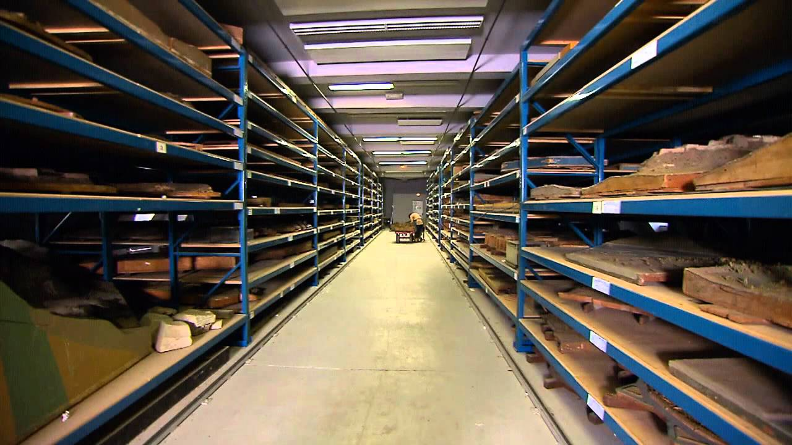
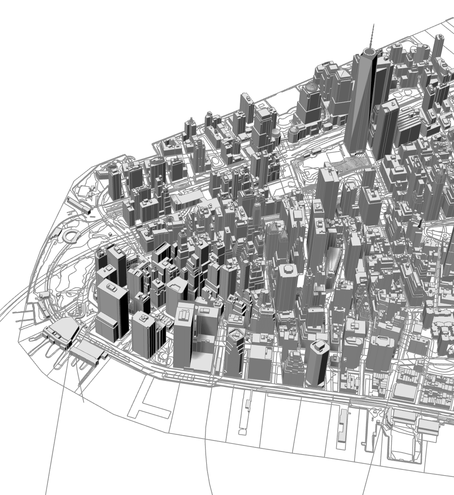

import ImageRight from '../../src/components/slides/imageRight';
import ImageAbove from '../../src/components/slides/imageAbove';
import Centered from '../../src/components/slides/centered';
import ThreeViewer from '../../src/components/threeViewer';
import Image from '../../src/components/slides/image';
import Table from '../../src/components/slides/table';
import { ImageStandalone } from '../../src/components/slides/imageStandalone';
import SVGInteractive from '../../src/components/svgInteractive';
import IFrame from '../../src/components/iframe';

<!-- END IMPORTS, BEGIN FIRST SLIDE -->

# Intro to Urban Design **Digital Practice**

---

## Welcome

- First in a three-part series on digital modeling practices in Urban Design
- Meant to introduce UD Digital Practice Initiative (DPI) and two products, the NYC Digital Twin and UDTools for Rhino
- Sessions 2 and 3 will be tutorials for UDTools
- This one's focused on background and can be more of a discussion
- Please feel free to interrupt with any questions or drop them in the chat!

<!-- DPI for short -->

---

## What's a computational designer?

- Subfield of architecture
- Architectural practice as a collection of technologies for **communicating** and **organizing spatial information**
- Traditional: drawings & models
- New: GIS, BIM, web and games

<!-- 

About me: I am an architect by training, Columbia M. Arch '18

Growing role of new media as a common language for different kinds of people

-->

---

The **Digital Practice Initiative** (DPI) seeks to amplify and add value to urban design and physical planning in NYC, through the development and dissemination of **tools**, **methods** & **data**.

We have a vision for how **digital models** can help designers and planners be more connected with places, work more efficiently, and communicate more vividly.

---

## What we'll talk about today:

- What can models do for us?
- Background and key challenges of the DPI
- Products:
  - NYC Digital Twin
  - UDTools for Rhino
- Next steps
- Resources

---

## What can models do for us?

---

<Image caption={'Image: City of San Francisco'} mode={'center'}>

</Image>

---

<Image caption={'Image: Musée des Plans-Reliefs'} mode={'center'}>

</Image>

---

<Image caption={'Image: Lucien Kroll'} mode={'center'}>

</Image>

---

<Image caption={'Image: Environmental Simulation Center'} mode={'center'}>

</Image>

---

<Image caption={'Image: Center for Urban Pedagogy'} mode={'center'}>

</Image>

---

Models, in general:

- Record and store information about places
- Are tangible and intuitive
- Provide answers to questions
- Keep everybody on the same page

---

*Digital* models do even more. They're much more powerful when it comes to answering questions. In urban design and physical planning, they can help:

- **Evaluate effects of zoning in 3D**
- **Quantify impact through detailed take-offs**
- **Coordinate consensus among stakeholders**

They're also cheap and reproducible.

---

Unfortunately they're less intuitive to work with than physical models. Digital modeling (as a *practice*) involves specialized **tools**, used together with the right **methods**, to access and manipulate **data**.

**The overarching goal of the DPI is to bridge the gap between the accessibility of physical models and the analytical power of digital ones.**

---

## How did this all start?

---

## The problem

Defining a RWCDS for CEQR used to require a huge amount of very tedious work.

<!-- UD has been exploring custom digital modeling tools since mid-2017
 -->

---

## The old way

- first, study area tax lots from MapPLUTO needed to be collected, clipped and converted to a CAD format using ArcMap
- then designers needed to "manually" mass individual development sites for each of the three CEQR analysis conditions
- then, once the form of each one was ready, each floor needed to be measured
- finally these measurements needed to be entered into a spreadsheet
- let's say we have **40 sites**, at **8 stories** each, across **three scenarios**
- that means repeating steps 2 and 3 almost 1000 times
- and then doing it all over again each time a site changes!

<!-- who remembers how long it took for ArcMap to open on our agency desktops? -->

---

Rumor has it the whole Urban Design division would sometimes be assigned to working on this for weeks.

Nobody wants this! so people started cooking up a plan...

---

- in late 2018 another computational designer, Xun Liu joined the urban design team
- together with David Vega-Barachowitz developed what was called the "Parametric Tool"

---

<ImageRight>

## The Parametric Tool

- Zoning is "parametric"
- That is, the buildable 3d envelope of a given zoning lot can be expressed (or approximated) through simple geometic rules
- This means it can be partly automated
- Developed and tested alongside three neighborhood studies:
  - Bushwick
  - North Brooklyn
  - Bronx Metro-North

<small>* or at least approximated...</small>

</ImageRight>

<!-- The new way of doing things saved tons of time and effort -->

---

<Image mode='center'>

<iframe width="800" height="600" src="https://www.youtube.com/embed/t09raikH9eE" frameborder="0" allow="accelerometer; autoplay; clipboard-write; encrypted-media; gyroscope; picture-in-picture" allowfullscreen></iframe>

</Image>

---

---

---

## Challenges: Parametric Tool

- People had started to talk about other possibilities beyond the RWCDS:
  - Other CEQR sections: shadow studies, open-space analysis
  - Zoning Spell-Check: pre-screen applicant projects for common problems
  - Flexible modeling and analysis environment for one-off projects
- The Parametric Tool focused on RWCDS only
- Tough to set up and use (requires knowledge of Grasshopper)
- Requires time-consuming setup and prep in GIS

---

## Needs

- Easier
- Contextually grounded
- More flexible

---

# **Solutions so far...**

---

## NYC Digital Twin

Sometimes access to the right materials (data) is just as important as having the right tools.

<!-- Not only is the initial step of obtaining base maps time-consuming and tricky for people without GIS knowledge, it's also critical to being able to go beyond a simplistic approximation of zoning rules, since so many rely on a site's immediate context. Having accessible, high-quality base maps is also helpful for the other use cases we'd started to talk about, not just the RWCDS. Finally, fetching and loading data is actually pretty easy to automate. Figuring out a better solution to this felt like a good, high-value project to start with when I came onboard in early 2020 -->

---

<ImageRight>

**Community District Models**

Downloadable Rhino files of each NYC Community District. Combines 3D building dataset from DOITT and 2D map data from other city sources, like sidewalks, parks, subway entrances.

✅ Convenient 3D view of the city  
✅ Released publicly through OpenData  

</ImageRight>

<!-- Around the same time the parametric tool was being developed, UD also released its first data product, the NYC 3D Model by Community District. This knits together data from several sister agencies (all published on OpenData) into a collection of Rhino files for each CD -->

<!-- DATA First, with the help of 2018 summer interns, Urban Design compiled a comprehensive citywide 3d model for Rhino and released it to the public as a set of downloadable files on Open Data... Since we've been working remotely, project teams have found that Rhino models derived from the 3D model are actually too large to use with Sharepoint-->

---

## Challenges: Community District Models

- Time-consuming to produce
- One-time compilation, hasn't ever been updated
- Large files discourage casual use
- Geometry only (no attributes)

<!-- still need to use GIS to get base map for RWCDS -->

---

<Image caption={'NYC Digital Twin'} mode={'center'}>

</Image>

---

<ImageRight>

## NYC Digital Twin

A 3D-enabled, automated spatial database that can be linked with different software.

- Lives "in the cloud"
- Provides multiple layers, sourced from Open Data
- Automatically updates to latest available releases
- Data from DCP, DOITT, Parks, DOT and others

</ImageRight>

<!-- explain the Digital Twin term?

Can be accessed from GIS, different data science environments, websites, or 3d modeling software like Rhino

**DCP is in a singular position to build and maintain this** because it is:

- Specific to NYC
- Based on our own data products (MapPLUTO)
- Not a "scalable" project

Again, having the best data possible is a precursor to a robust zoning algorithm

 -->

---

<Table scale='small'>

| Layer | Source | Metadata |
|---|---|---|
| `dcp_streetcenterline` | DCP [Digital City Map](https://www1.nyc.gov/site/planning/data-maps/open-data.page#digitalcitymap) | [link](https://www1.nyc.gov/site/planning/data-maps/open-data/dwn-digital-city-map.page#metadata) |
| `dcp_taxlots` | DCP [MapPLUTO](https://www1.nyc.gov/site/planning/data-maps/open-data.page#pluto) | [link](https://www1.nyc.gov/assets/planning/download/pdf/data-maps/open-data/meta_mappluto.pdf?r=20v6) |
| `dcp_zoning` | DCP [NYC GIS Zoning Features](https://www1.nyc.gov/site/planning/data-maps/open-data.page#zoning_related) | [link](https://www1.nyc.gov/site/planning/data-maps/open-data/dwn-gis-zoning.page#metadata) |
| `doitt_boardwalk` | DOITT [Planimetrics](https://data.cityofnewyork.us/Transportation/NYC-Planimetrics/wt4d-p43d) | [link](https://github.com/CityOfNewYork/nyc-planimetrics/blob/master/Capture_Rules.md) |
| `doitt_buildings` | DOITT [NYC 3-D Building Model](https://www1.nyc.gov/site/doitt/initiatives/3d-building.page) | [link](https://github.com/CityOfNewYork/nyc-geo-metadata/blob/master/Metadata/Metadata_3DBuildingModel.md) |
| `doitt_elevation` | DOITT [1 Foot Digital Elevation Model (Integer)](https://data.cityofnewyork.us/City-Government/1-foot-Digital-Elevation-Model-DEM-Integer-Raster/7kuu-zah7) | [link](https://github.com/CityOfNewYork/nyc-geo-metadata/blob/master/Metadata/Metadata_DigitalElevationModel.md) |
| `doitt_hydrography` | DOITT [Planimetrics](https://data.cityofnewyork.us/Transportation/NYC-Planimetrics/wt4d-p43d) | [link](https://github.com/CityOfNewYork/nyc-planimetrics/blob/master/Capture_Rules.md) |
| `doitt_hydrostructure` | DOITT [Planimetrics](https://data.cityofnewyork.us/Transportation/NYC-Planimetrics/wt4d-p43d) | [link](https://github.com/CityOfNewYork/nyc-planimetrics/blob/master/Capture_Rules.md) |
| `doitt_median` | DOITT [Planimetrics](https://data.cityofnewyork.us/Transportation/NYC-Planimetrics/wt4d-p43d) | [link](https://github.com/CityOfNewYork/nyc-planimetrics/blob/master/Capture_Rules.md) |
| `doitt_miscstructurepoly` | DOITT [Planimetrics](https://data.cityofnewyork.us/Transportation/NYC-Planimetrics/wt4d-p43d) | [link](https://github.com/CityOfNewYork/nyc-planimetrics/blob/master/Capture_Rules.md) |
| `doitt_openspacenopark` | DOITT [Planimetrics](https://data.cityofnewyork.us/Transportation/NYC-Planimetrics/wt4d-p43d) | [link](https://github.com/CityOfNewYork/nyc-planimetrics/blob/master/Capture_Rules.md) |
| `doitt_park` | DOITT [Planimetrics](https://data.cityofnewyork.us/Transportation/NYC-Planimetrics/wt4d-p43d) | [link](https://github.com/CityOfNewYork/nyc-planimetrics/blob/master/Capture_Rules.md) |
| `doitt_parkinglot` | DOITT [Planimetrics](https://data.cityofnewyork.us/Transportation/NYC-Planimetrics/wt4d-p43d) | [link](https://github.com/CityOfNewYork/nyc-planimetrics/blob/master/Capture_Rules.md) |
| `doitt_plaza` | DOITT [Planimetrics](https://data.cityofnewyork.us/Transportation/NYC-Planimetrics/wt4d-p43d) | [link](https://github.com/CityOfNewYork/nyc-planimetrics/blob/master/Capture_Rules.md) |
| `doitt_railroadstructure` | DOITT [Planimetrics](https://data.cityofnewyork.us/Transportation/NYC-Planimetrics/wt4d-p43d) | [link](https://github.com/CityOfNewYork/nyc-planimetrics/blob/master/Capture_Rules.md) |
| `doitt_retainingwall` | DOITT [Planimetrics](https://data.cityofnewyork.us/Transportation/NYC-Planimetrics/wt4d-p43d) | [link](https://github.com/CityOfNewYork/nyc-planimetrics/blob/master/Capture_Rules.md) |
| `doitt_roadbed` | DOITT [Planimetrics](https://data.cityofnewyork.us/Transportation/NYC-Planimetrics/wt4d-p43d) | [link](https://github.com/CityOfNewYork/nyc-planimetrics/blob/master/Capture_Rules.md) |
| `doitt_shoreline` | DOITT [Planimetrics](https://data.cityofnewyork.us/Transportation/NYC-Planimetrics/wt4d-p43d) | [link](https://github.com/CityOfNewYork/nyc-planimetrics/blob/master/Capture_Rules.md) |
| `doitt_sidewalk` | DOITT [Planimetrics](https://data.cityofnewyork.us/Transportation/NYC-Planimetrics/wt4d-p43d) | [link](https://github.com/CityOfNewYork/nyc-planimetrics/blob/master/Capture_Rules.md) |
| `doitt_swimmingpool` | DOITT [Planimetrics](https://data.cityofnewyork.us/Transportation/NYC-Planimetrics/wt4d-p43d) | [link](https://github.com/CityOfNewYork/nyc-planimetrics/blob/master/Capture_Rules.md) |
| `doitt_transportstructure` | DOITT [Planimetrics](https://data.cityofnewyork.us/Transportation/NYC-Planimetrics/wt4d-p43d) | [link](https://github.com/CityOfNewYork/nyc-planimetrics/blob/master/Capture_Rules.md) |
| `dpr_streettree` | DPR [Street Tree Census](https://data.cityofnewyork.us/Environment/2015-Street-Tree-Census-Tree-Data/uvpi-gqnh) | [link](https://data.cityofnewyork.us/api/views/uvpi-gqnh/files/8705bfd6-993c-40c5-8620-0c81191c7e25?download=true&filename=StreetTreeCensus2015TreesDataDictionary20161102.pdf) |

</Table>

<!-- What's in the Digital Twin now? -->

---

<ImageRight>

## UDTools for Rhino

Rhino = best-in-class 3D modeling software

Accurate, fast, powerful and **extensible**

- UDTools seamlessly adds new functionality to Rhino:
  - Fetch context models of real-world sites from NYC Digital Twin
  - "Understand" Zoning Lots spatially
  - **Generate** RWC envelopes and massings
  - **Measure** impact from key metrics in real time

</ImageRight>

<!-- This extensibility feature is really important, different industries like jewlery, industrial robotics and more all have Rhino plugins that enable users to deal with the kinds of things people model more efficiently. It makes Rhino, a general tool for 3d geometry, into something more specific (in our case, urban design and physical planning)

Introduce "smart objects"? 

  - Saved file provides a single "source of truth" on large/complex projects

 -->

---

<Image caption={'1. Set Context'} mode={'center'}>

</Image>

---

<Image caption={'2. Set Site Locations'} mode={'center'}>

</Image>

---

<Image caption={'3. Generate Envelopes and Massings'} mode={'center'}>

</Image>

---

<Image caption={'4. Calculate Key Metrics'} mode={'center'}>

</Image>

---

<Image caption={'Beyond the RWCDS'} mode={'interactive-zoom'}>

</Image>

---

# **Future Directions**

---

## Grasshopper Components for Environmental/Custom Analysis

<!-- Users can access and manipulate low-level functions without need for programming know-how. Userful for custom analysis workflows and environmental simulation. Like shadow studies! -->

---

## Digital Engagement Deliverables

---

<IFrame src='https://ud-interactive.netlify.app/residential-buildings' />

---

## Data Science Projects and Collaborations

---

## Zoning Spell-Check Plugins for Rhino/Revit

## Digital Twin Viewers for Non-designers

## Applicant Model Pipeline

---

## Resources

You can always find up-to-date information, tutorials and other resources on the DPI documentation site:

https://ud-digital-practice.netlify.app/

<!-- links on The GUide will be up soon -->

---

# **Thank You**
