import ImageRight from '../../src/components/slides/imageRight';
import ImageAbove from '../../src/components/slides/imageAbove';
import Centered from '../../src/components/slides/centered';
import ThreeViewer from '../../src/components/threeViewer';
import Image from '../../src/components/slides/image';
import Table from '../../src/components/slides/table';
import { ImageStandalone } from '../../src/components/slides/imageStandalone';
import SVGInteractive from '../../src/components/svgInteractive';
import IFrame from '../../src/components/iframe';

<!-- END IMPORTS, BEGIN FIRST SLIDE -->

# Intro to Urban Design **Digital Practice**

---

## Welcome

- #1 in a three-part series on digital modeling practices in UD
- Meant to introduce UD Digital Practice Initiative (DPI)
- Sessions 2 and 3 are planned as software tutorials

Please feel free to interrupt with any questions or drop them in the chat!

<!-- 

~5mins to start

this will be an introduction to the Digital practice initiative or what we're calling the DPI, its goals and some of the challenges we face

Sessions 2 and 3 will be held in march

I'm going to throw a lot of ideas and information out but hopefully this won't be a completely one-sided conversation.

Will leave room at the end hopefully for more Q&A and discussion, but feel free to interrupt during the session too.

-->

---

## What's Computational Design?

- Subfield of architecture
- Architectural practice as a collection of technologies for **communicating,** and **organizing spatial information**
- Traditional media: drawings & models
- New media: web, games, GIS and BIM

<!-- 

I know most of you by now in spite of the pandemic – I'll introduce myself to kick off just in case. I started just about a year ago as the lead computational designer for the urban design office. What does that mean?

I'm an architect by training, Columbia M. Arch '18. Computational design is a kind of sub-field of architecture focused on how designers can use computers in their work, a little non-specific if you ask me.

While there's a lot of high-profile work out there focused on "generative design", I'm more interested in two things that aren't super different from what an architect would do normally, that is, using a bunch of different tools and techniques to communicate about and organize spatial information.

The traditional way this happens is through drawings and models, I'm also super interested in new mediums like websites, games and tools like GIS and BIM as ways of doing this. The first two are interesting since they're becoming more and more accessible and democratic, and the second two are interesting because of their analytical power and potential to save time.

COMPUTATIONAL DESIGN ISN'T SPECIAL MAGIC THAT ONLY SOME PEOPLE HAVE – it's a set of ideas that anyone can use in your work and so today you're all going to become computational designers.

Today is like the day you get your Hogwarts letter, and find out you're actually a witch or a wizard, only you're finding out that you're a actually a computational designer. Bear with me!

-->

---

<Image caption={'You are now a Computational Designer!'} mode={'center'}>

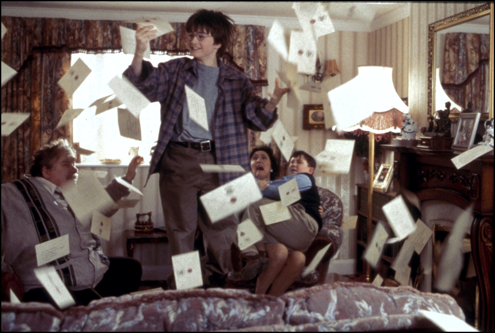

</Image>

---

<!-- 

So broadly my job here is about bringing some of these tools and techniques to bear on the work we do here at DCP, as reflected in this mission statement we've come up with.

 -->

The **Digital Practice Initiative** (DPI) seeks to amplify and add value to urban design and physical planning in NYC, through the development and dissemination of **tools**, **methods** & **data**.

We have a vision for how **digital models** can help designers and planners be more connected with places, work more efficiently, and communicate more vividly.

---

## What we'll talk about today:

- Precedents: What can models do for us?
- Project background and key challenges
- Products:
  - NYC Digital Twin
  - UDTools for Rhino
- Future directions
- Resources

<!-- 

Again, this is meant to be an introduction to the work program and what we have to offer, the second and third sessions later in March will cover specifics of how to use the software tools I'm developing for the agency.

 -->

---

## What can models do for us?

---

<Image caption={'Plans-Reliefs'} mode={'interactive-zoom'}>

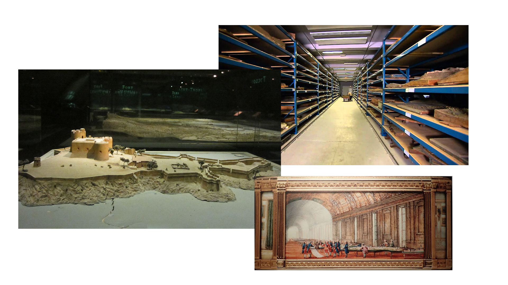

</Image>

---

<Image caption={'San Francisco City Model'} mode={'interactive-zoom'}>

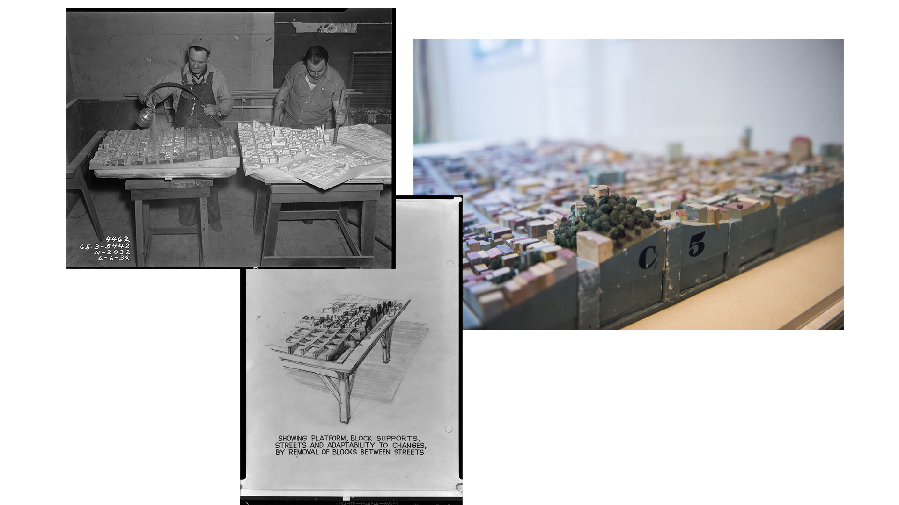

</Image>

---

<Image caption={'Image: Environmental Simulation Center'} mode={'center'}>

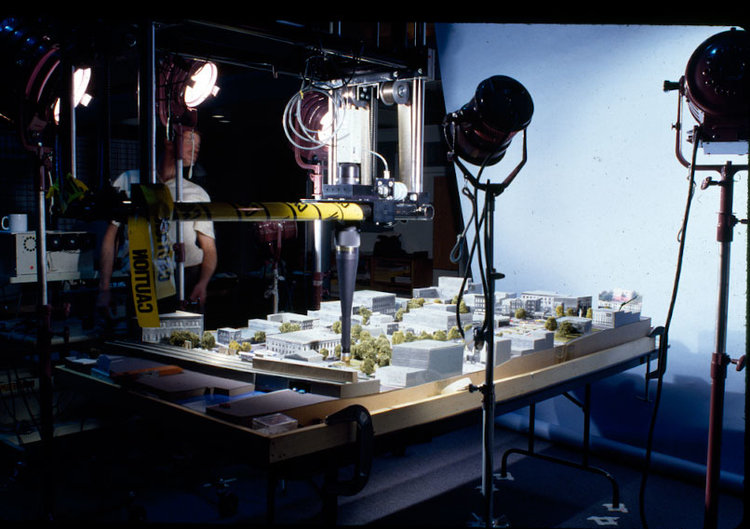

</Image>

---

<Image caption={'Image: Lucien Kroll'} mode={'center'}>

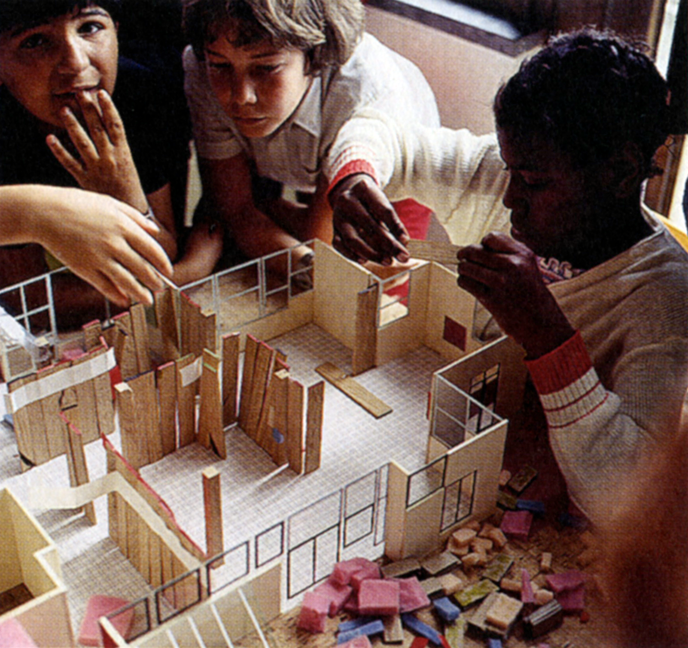

</Image>

---

<Image caption={'Image: Center for Urban Pedagogy'} mode={'center'}>

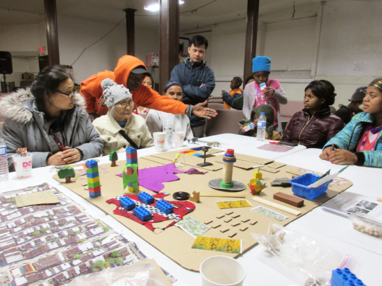

</Image>

---

Models, in general:

- Record and store information about places
- Provide answers to questions
- Are tangible and intuitive
- Keep everybody on the same page

---

*Digital* models do even more. They're much more powerful when it comes to answering questions. In urban design and physical planning, they can help:

- **Evaluate effects of zoning in 3D**
- **Quantify impact through detailed take-offs**
- **Coordinate consensus among stakeholders**

They're also cheap and reproducible.

<!-- 

For anyone who's unfamiliar, a take-off is a term from the construction industry that refers to quantitative information you're getting from looking at a set of construction documents, traditionally drawings.

-->

---

Unfortunately they're less intuitive to work with than physical models. Digital modeling (as a *practice*) involves specialized **tools**, used together with the right **methods**, to access and manipulate **data**.

**The current focus of the DPI is to bridge the gap between the accessibility of physical models and the analytical power of digital ones.**

<!-- Here's this trifecta of tools, methods and data again – you'll hear me refer back to these a few more times. -->

---

## Project Background

How did this all start?

---

## The Problem

Defining a RWCDS for CEQR used to require a huge amount of very tedious work.

<!--

Next we want to understand how DCP got (back) into the model business, and what's happened so far to advance some of these new methods.

Rewinding to 2017, the problem was like so:

I'm pretty new still so I don't have a great sense of who was around when this was happening – Was anybody here around for this part?

In order to do the analysis work required under CEQR, you have to first define a RWCDS – Reasonable Worst Case Development Scenario. Ultimately this definition is reflected in a 3d model and a giant Excel spreadsheet (the technical term for this, I understand, is "The Big Spreadsheet")

-->

---

## The Old Way*

*Do not attempt to try this at home!

<!-- Since we're all at home for the forseeable future, or at least until May, I need to add this disclaimer -->

---

<ImageRight>

1. Using ArcMap, get a fresh copy of MapPLUTO, clip it to your study area and use it to define the different **sites** that make up the RWCDS. Export to CAD.

</ImageRight>

<!-- Watch these characters in bold, they're going to become our friends later. -->

---

<ImageRight>

2. Use 3D modeling software to first create **zoning envelopes**, then **massings** for each individual site, under each **scenario** being considered (usually Existing, No Action and With Action).

</ImageRight>

---

<ImageRight>

3. Measure the floor area of each story in each massing and record it in a spreadsheet.

</ImageRight>

<!-- 

Quick pause: 

Let's say we have **40 sites**, at **8 stories** each, across **three scenarios**

This isn't super likely since the Existing and No Action scenarios often don't need new massings. But in the unreasonable (!) worst case version of the reasonable worst case development scenario that means repeating step 3 almost 1000 times!

-->

---

<ImageRight>

4. Repeat every time there are changes to the site list or zoning.

</ImageRight>

---

Rumor has it the whole Urban Design division would sometimes be assigned to working on this for weeks.

Not good! Thus the motivation to find a better way was created.

---

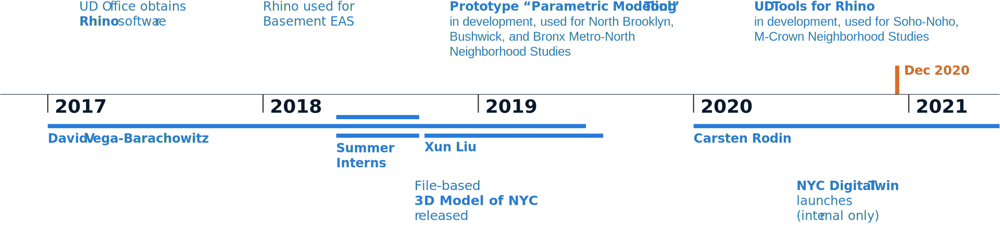

---

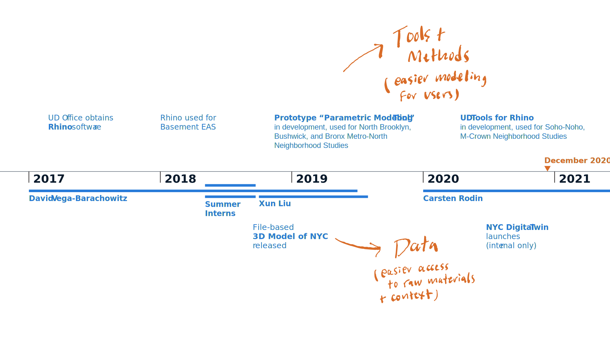

<!-- David Vega Barachowitz and later Xun Liu started this whole work program around improving our ability to work with models. Notice the "Parametric Tool" which I'll talk about in a second and the NYC 3D Model by Community District which I'll touch on in a little while -->

---

<ImageRight>

## The Parametric Tool

- Zoning is "parametric"
- That is, the buildable 3d envelope of a given zoning lot can be expressed through simple geometic rules*
- This means, in theory, the RWCDS can be automated
- Developed and tested alongside three neighborhood studies:
  - Bushwick
  - North Brooklyn
  - Bronx Metro-North

\* obviously, a huge caveat here

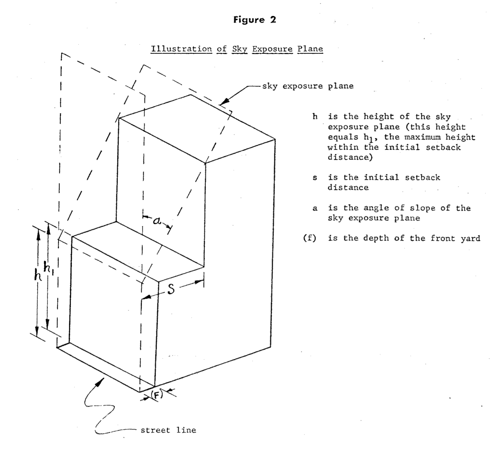

</ImageRight>

<!-- 

The phrase trial by fire comes to mind.

Still, the new way of doing things saved tons of time and effort.

-->

---

<Image mode='center'>

<iframe width="800" height="600" src="https://www.youtube.com/embed/t09raikH9eE" frameborder="0" allow="accelerometer; autoplay; clipboard-write; encrypted-media; gyroscope; picture-in-picture" allowfullscreen></iframe>

</Image>

<!-- 

Here's what it looked like. You can see it's hooked up to The Big Spreadsheet directly.

-->

---

## Challenges: Parametric Tool

- People had started to talk about other possibilities beyond the RWCDS:
  - Other CEQR Sections: shadow studies, open-space analysis
  - Zoning Spell-Check: pre-screen applicant projects for common problems
  - Flexible modeling and analysis environment for one-off projects
- The Parametric Tool focused on RWCDS only
- Tough to set up and use (requires knowledge of Grasshopper)
- Requires time-consuming setup and prep in GIS

<!-- 

Grasshopper is a visual programming environment included with the Rhino 3D modeling software.

So the process got faster but at the cost of a big learning curve, and the Parametric Tool got kind of "typecast" in just one of a growing list of roles.

-->

---

## Needs

- Easier
- More accessible spatial data
- More flexible

---

# **Solutions so far...**

---

## NYC Digital Twin

Sometimes access to the right materials (data) is just as important as having the right tools.

<!-- Not only is the initial step of obtaining base maps time-consuming and tricky for people without GIS knowledge, it's also critical to being able to go beyond a simplistic approximation of zoning rules, since so many rely on a site's immediate context. Having accessible, high-quality base maps is also helpful for the other use cases we'd started to talk about, not just the RWCDS. Finally, fetching and loading data is actually pretty easy to automate. Figuring out a better solution to this felt like a good, high-value project to start with when I came onboard in early 2020 -->

---

<ImageRight>

**Community District Models**

Downloadable Rhino files of each NYC Community District. Combines 3D building dataset from DOITT and 2D map data from other city sources, like sidewalks, parks, subway entrances.

✅ Convenient 3D view of the city  
✅ Released publicly through OpenData  

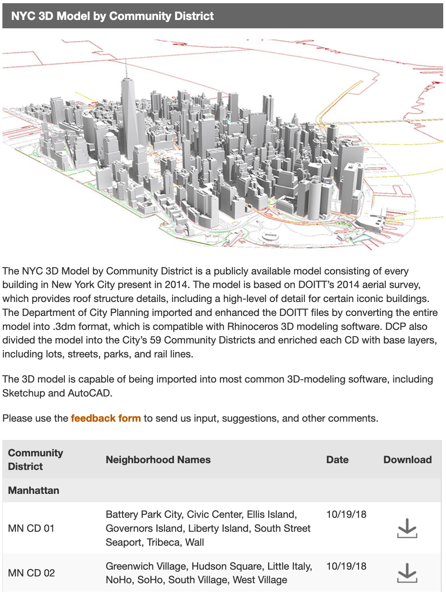

</ImageRight>

<!-- Around the same time the parametric tool was being developed, UD also released its first data product, the NYC 3D Model by Community District. This knits together data from several sister agencies (all published on OpenData) into a collection of Rhino files for each CD -->

<!-- DATA First, with the help of 2018 summer interns, Urban Design compiled a comprehensive citywide 3d model for Rhino and released it to the public as a set of downloadable files on Open Data... Since we've been working remotely, project teams have found that Rhino models derived from the 3D model are actually too large to use with Sharepoint-->

---

## Challenges: Community District Models

- Time-consuming to produce
- One-time compilation, hasn't ever been updated
- Large files discourage casual use
- Geometry only (no attributes)

<!-- still need to use GIS to get base map for RWCDS -->

---

<ImageRight>

## NYC Digital Twin

A 3D-enabled, automated spatial database that can be linked with different software.

- Lives "in the cloud"
- Provides multiple layers, sourced from Open Data
- Automatically updates to latest available releases
- Data from DCP, DOITT, Parks, DOT and others

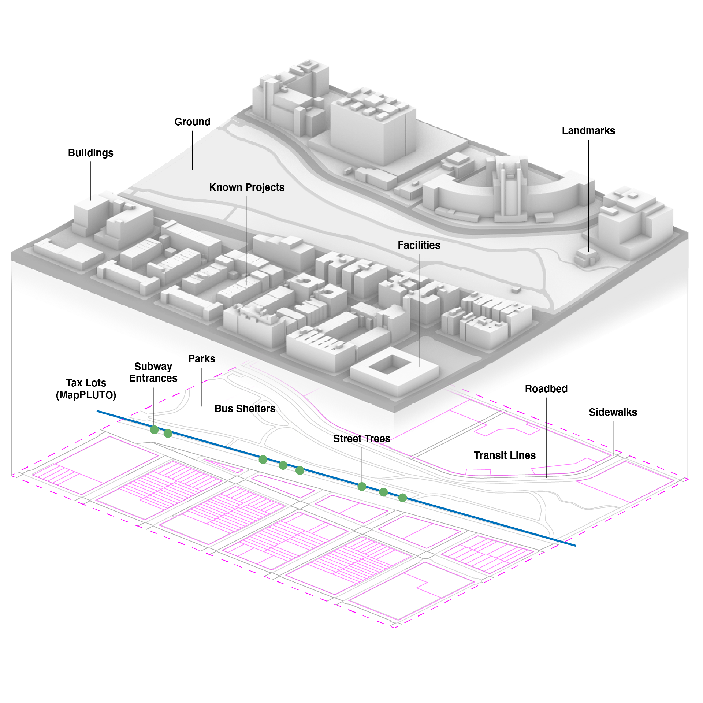

</ImageRight>

<!-- explain the Digital Twin term?

Can be accessed from GIS, different data science environments, websites, or 3d modeling software like Rhino

**DCP is in a singular position to build and maintain this** because it is:

- Specific to NYC
- Based on our own data products (MapPLUTO)
- Not a "scalable" project

Again, having the best data possible is a precursor to a robust zoning algorithm

 -->

---

<Table scale='small'>

| Layer | Source | Metadata |
|---|---|---|
| `dcp_streetcenterline` | DCP [Digital City Map](https://www1.nyc.gov/site/planning/data-maps/open-data.page#digitalcitymap) | [link](https://www1.nyc.gov/site/planning/data-maps/open-data/dwn-digital-city-map.page#metadata) |
| `dcp_taxlots` | DCP [MapPLUTO](https://www1.nyc.gov/site/planning/data-maps/open-data.page#pluto) | [link](https://www1.nyc.gov/assets/planning/download/pdf/data-maps/open-data/meta_mappluto.pdf?r=20v6) |
| `dcp_zoning` | DCP [NYC GIS Zoning Features](https://www1.nyc.gov/site/planning/data-maps/open-data.page#zoning_related) | [link](https://www1.nyc.gov/site/planning/data-maps/open-data/dwn-gis-zoning.page#metadata) |
| `doitt_boardwalk` | DOITT [Planimetrics](https://data.cityofnewyork.us/Transportation/NYC-Planimetrics/wt4d-p43d) | [link](https://github.com/CityOfNewYork/nyc-planimetrics/blob/master/Capture_Rules.md) |
| `doitt_buildings` | DOITT [NYC 3-D Building Model](https://www1.nyc.gov/site/doitt/initiatives/3d-building.page) | [link](https://github.com/CityOfNewYork/nyc-geo-metadata/blob/master/Metadata/Metadata_3DBuildingModel.md) |
| `doitt_elevation` | DOITT [1 Foot Digital Elevation Model (Integer)](https://data.cityofnewyork.us/City-Government/1-foot-Digital-Elevation-Model-DEM-Integer-Raster/7kuu-zah7) | [link](https://github.com/CityOfNewYork/nyc-geo-metadata/blob/master/Metadata/Metadata_DigitalElevationModel.md) |
| `doitt_hydrography` | DOITT [Planimetrics](https://data.cityofnewyork.us/Transportation/NYC-Planimetrics/wt4d-p43d) | [link](https://github.com/CityOfNewYork/nyc-planimetrics/blob/master/Capture_Rules.md) |
| `doitt_hydrostructure` | DOITT [Planimetrics](https://data.cityofnewyork.us/Transportation/NYC-Planimetrics/wt4d-p43d) | [link](https://github.com/CityOfNewYork/nyc-planimetrics/blob/master/Capture_Rules.md) |
| `doitt_median` | DOITT [Planimetrics](https://data.cityofnewyork.us/Transportation/NYC-Planimetrics/wt4d-p43d) | [link](https://github.com/CityOfNewYork/nyc-planimetrics/blob/master/Capture_Rules.md) |
| `doitt_miscstructurepoly` | DOITT [Planimetrics](https://data.cityofnewyork.us/Transportation/NYC-Planimetrics/wt4d-p43d) | [link](https://github.com/CityOfNewYork/nyc-planimetrics/blob/master/Capture_Rules.md) |
| `doitt_openspacenopark` | DOITT [Planimetrics](https://data.cityofnewyork.us/Transportation/NYC-Planimetrics/wt4d-p43d) | [link](https://github.com/CityOfNewYork/nyc-planimetrics/blob/master/Capture_Rules.md) |
| `doitt_park` | DOITT [Planimetrics](https://data.cityofnewyork.us/Transportation/NYC-Planimetrics/wt4d-p43d) | [link](https://github.com/CityOfNewYork/nyc-planimetrics/blob/master/Capture_Rules.md) |
| `doitt_parkinglot` | DOITT [Planimetrics](https://data.cityofnewyork.us/Transportation/NYC-Planimetrics/wt4d-p43d) | [link](https://github.com/CityOfNewYork/nyc-planimetrics/blob/master/Capture_Rules.md) |
| `doitt_plaza` | DOITT [Planimetrics](https://data.cityofnewyork.us/Transportation/NYC-Planimetrics/wt4d-p43d) | [link](https://github.com/CityOfNewYork/nyc-planimetrics/blob/master/Capture_Rules.md) |
| `doitt_railroadstructure` | DOITT [Planimetrics](https://data.cityofnewyork.us/Transportation/NYC-Planimetrics/wt4d-p43d) | [link](https://github.com/CityOfNewYork/nyc-planimetrics/blob/master/Capture_Rules.md) |
| `doitt_retainingwall` | DOITT [Planimetrics](https://data.cityofnewyork.us/Transportation/NYC-Planimetrics/wt4d-p43d) | [link](https://github.com/CityOfNewYork/nyc-planimetrics/blob/master/Capture_Rules.md) |
| `doitt_roadbed` | DOITT [Planimetrics](https://data.cityofnewyork.us/Transportation/NYC-Planimetrics/wt4d-p43d) | [link](https://github.com/CityOfNewYork/nyc-planimetrics/blob/master/Capture_Rules.md) |
| `doitt_shoreline` | DOITT [Planimetrics](https://data.cityofnewyork.us/Transportation/NYC-Planimetrics/wt4d-p43d) | [link](https://github.com/CityOfNewYork/nyc-planimetrics/blob/master/Capture_Rules.md) |
| `doitt_sidewalk` | DOITT [Planimetrics](https://data.cityofnewyork.us/Transportation/NYC-Planimetrics/wt4d-p43d) | [link](https://github.com/CityOfNewYork/nyc-planimetrics/blob/master/Capture_Rules.md) |
| `doitt_swimmingpool` | DOITT [Planimetrics](https://data.cityofnewyork.us/Transportation/NYC-Planimetrics/wt4d-p43d) | [link](https://github.com/CityOfNewYork/nyc-planimetrics/blob/master/Capture_Rules.md) |
| `doitt_transportstructure` | DOITT [Planimetrics](https://data.cityofnewyork.us/Transportation/NYC-Planimetrics/wt4d-p43d) | [link](https://github.com/CityOfNewYork/nyc-planimetrics/blob/master/Capture_Rules.md) |
| `dpr_streettree` | DPR [Street Tree Census](https://data.cityofnewyork.us/Environment/2015-Street-Tree-Census-Tree-Data/uvpi-gqnh) | [link](https://data.cityofnewyork.us/api/views/uvpi-gqnh/files/8705bfd6-993c-40c5-8620-0c81191c7e25?download=true&filename=StreetTreeCensus2015TreesDataDictionary20161102.pdf) |

</Table>

<!-- What's in the Digital Twin now? -->

---

<IFrame mode='full' src='https://ud-interactive.netlify.app/digital-twin' />

<!-- How do we use it? -->

---

<!-- 

a super quick technical thing - species of shapes 

-->

---

<!-- pure geometry (Rhino) to attributes (GIS) to classes (BIM) -->

---

<ImageRight>

## UDTools for Rhino

Rhino is a preferred 3d modeling tool across different industries because it's accurate, fast, powerful and **extensible**.

- UDTools seamlessly adds new functionality to Rhino:
  - Fetch site models from NYC Digital Twin
  - "Understand" Zoning Lots spatially
  - **Generate** RWC envelopes and massings
  - **Measure** impact from key metrics in real time

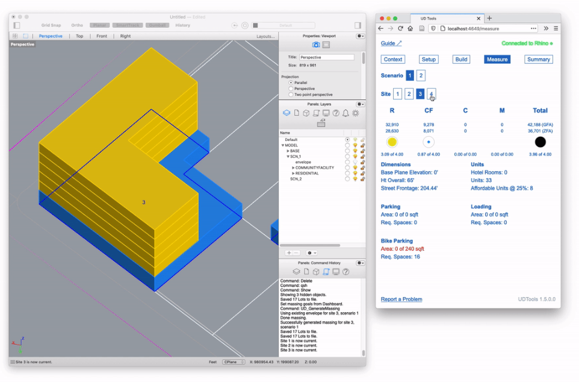

</ImageRight>

<!-- This extensibility feature is really important, different industries like jewlery, industrial robotics and more all have Rhino plugins that enable users to deal with the kinds of things people model more efficiently. It makes Rhino, a general tool for 3d geometry, into something more specific (in our case, urban design and physical planning)

Introduce "smart objects"? 

- Saved file provides a single "source of truth" on large/complex projects

-->

---

<Image caption={'1. Set Context'} mode={'center'}>

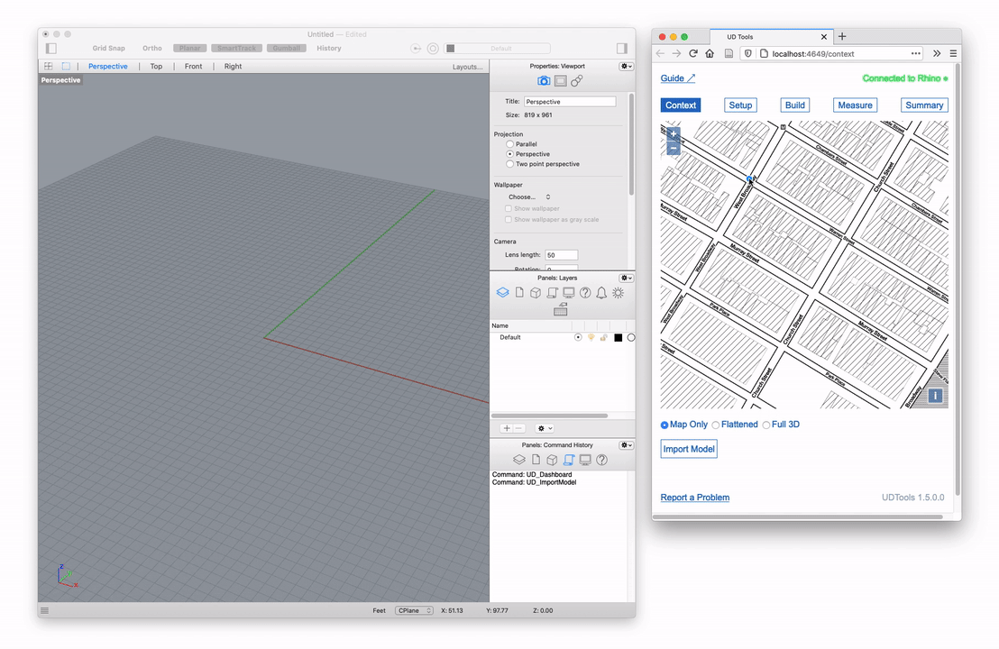

</Image>

---

<Image caption={'2. Set Site Locations'} mode={'center'}>

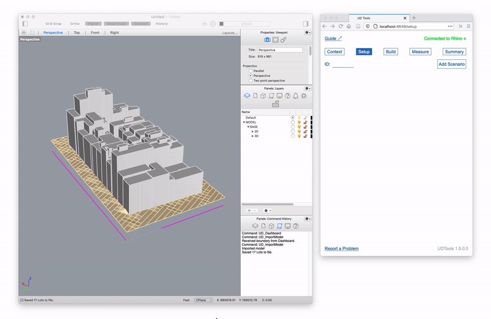

</Image>

---

<Image caption={'3. Generate Envelopes and Massings'} mode={'center'}>

</Image>

---

<Image caption={'4. Calculate Key Metrics'} mode={'center'}>

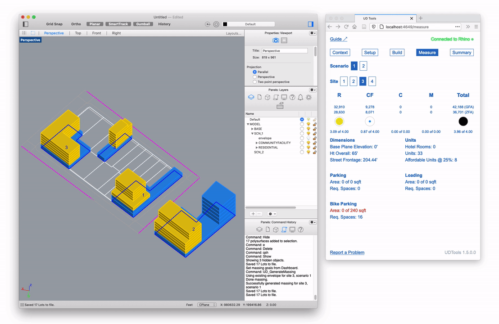

</Image>

---

# **Future Directions**

- Environmental analysis (Grasshopper)
- Data science projects (Python/R)
- Digital engagement (Three.js)
- Zoning Spell-Check: plugins for Rhino/Revit
- Digital Twin: viewers for non-designers
- Applicant model pipeline

<!-- 

Organized roughly in order of ease/possibility, here are a few other things we're working towards

-->

---

<Image caption={'Beyond the RWCDS'} mode={'interactive-zoom'}>

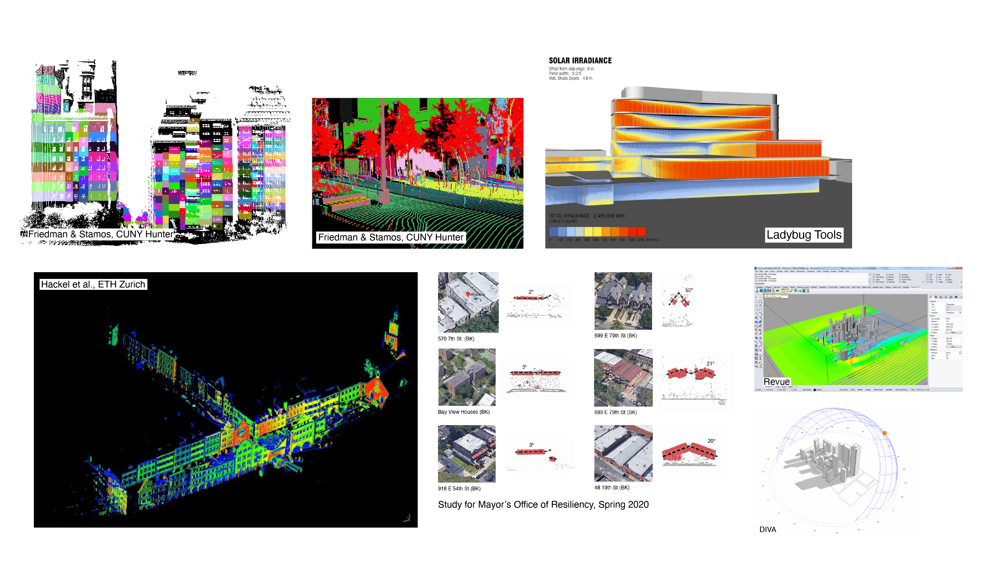

</Image>

<!-- Users can access and manipulate low-level functions without need for programming know-how. Userful for custom analysis workflows and environmental simulation. Like shadow studies! -->

---

<IFrame src='https://ud-interactive.netlify.app/residential-buildings' />

---

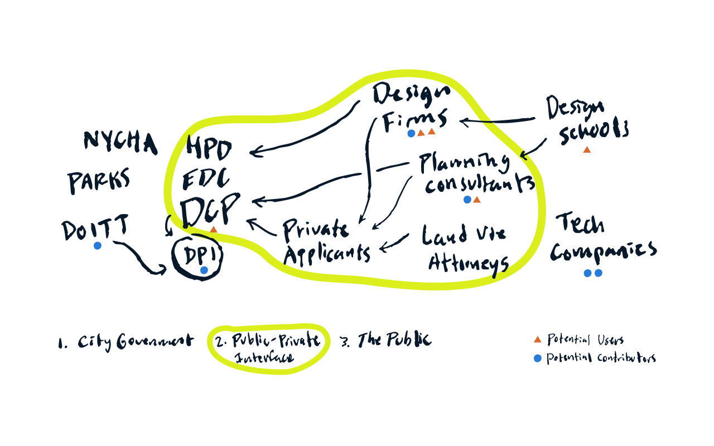

---

## Resources

You can always find up-to-date information, tutorials and other resources on the DPI documentation site:

https://ud-digital-practice.netlify.app/

<!-- 

links on The GUide will be up soon. For additional help, contact Crystal Eksi for one-on-one trainings and project support. Requests for more extensive collaborations should be directed to Erick Gregory, and Carsten Rodin is available on a limited basis to discuss tool-specific issues and ideas for future development.

-->

---

<ImageRight>

Slides will be posted EOD at:  

https://ud-digital-practice.netlify.app/slides/2021-01-29_cont-ed-dpi-intro

</ImageRight>
